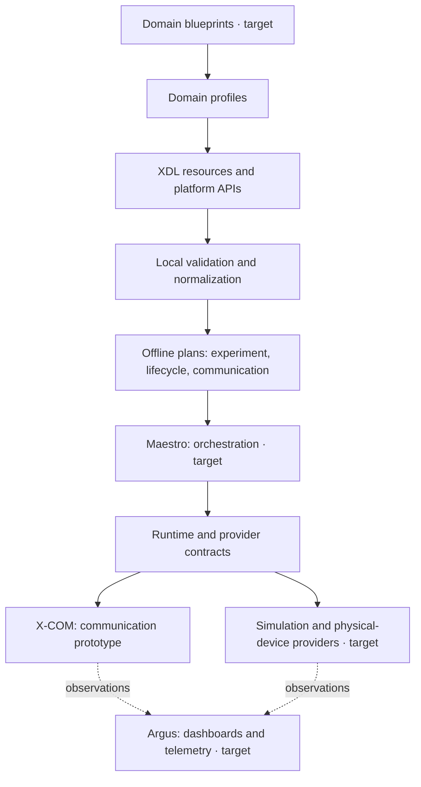

# X-Verse

X-Verse is a platform for describing and experimenting with cyber-physical systems:
systems where software interacts with simulated models, virtual hardware, or physical
devices. Its goal is to let you describe a system once, choose how its components are
realized, and reuse that description across experiments.

For example, a sensor can keep the same logical identity while a deployment selects a
simulated sensor or a physical device. The platform core uses domain-neutral concepts;
automotive, robotics, energy, and other domain conventions belong in profiles and
blueprints.

**This repository is an alpha platform foundation.** You can use its local XDL tools
and bounded prototypes today. A complete experiment runtime, orchestration service,
and dashboard remain under development.

- [What you can use today](#what-you-can-use-today)
- [Architecture](#architecture)
- [Getting started](#getting-started)
- [Working with your own system](#working-with-your-own-system)
- [Building X-COM](#building-x-com)
- [Documentation](#documentation)

## What you can use today

| Capability | What it lets you do | Current scope |
| --- | --- | --- |
| XDL validation and normalization | Check YAML/JSON system descriptions and produce canonical JSON. | Accepted local prototype, supporting `xverse.io/xdl/v1alpha1`. |
| XDL Lite experiment compilation | Turn a complete set of descriptions into a resolved experiment plan with input provenance and a digest. | Accepted Phase 1 prototype; compiles declared intent offline. |
| Component catalog and lifecycle | Derive a catalog from XDL, build a lifecycle plan, and exercise ownership, permits, and evidence recording. | Implemented prototype with an isolated fixture demonstration. |
| X-COM | Develop against C++ communication, observation, controlled stimulation, and local IPC/gRPC gateway contracts. | Accepted bounded prototype with owned loopback and synthetic-tool evidence. |
| Maestro | Coordinate experiment and component lifecycles. | Architectural target. |
| Argus | Present telemetry, dashboards, and experiment evidence. | Architectural target. |

A valid description or resolved plan establishes static consistency. Live readiness,
production deployment, legacy compatibility, and application parity require separate
validation. The examples below validate or compile descriptions; the lifecycle demo
uses an isolated in-memory fixture.

## Architecture

XDL, the **X-Verse Definition Language**, is the canonical YAML/JSON representation of
systems, deployments, and scenarios. It connects a logical system description to
explicit implementation and execution contracts.

The diagram shows the architectural direction. Boxes marked **target** are planned
subsystems; the diagram does not imply that a complete execution pipeline exists.



The responsibilities are:

- **XDL** describes what a system contains, where it is realized, and what an experiment
  intends to do. The Python `xverse_xdl` package implements local validation,
  normalization, and planning.
- **Maestro** is the planned orchestration subsystem. Early lifecycle mechanics are
  currently implemented in `xverse_xdl`.
- **X-COM** implements the C++ communication boundary, including controlled observation
  and stimulation for validation tools. Its current provider evidence is limited to
  owned fixtures and local IPC.
- **Argus** is the planned observability subsystem for telemetry presentation and
  dashboards. X-COM supplies observation boundaries that it can consume.
- **Providers** bind platform contracts to concrete implementations. Simulation,
  virtual hardware, and physical devices are distinct realizations of logical elements.

Dependencies flow from blueprints through domain profiles and XDL/platform APIs to
runtime abstractions. The core stays independent of domain-specific blueprints.

This repository owns the domain-neutral platform. Companion repositories have separate
roles: `xverse-compat` owns compatibility boundaries, and `xverse-blueprints` owns
composed domain examples. You can use the local XDL tools from this repository alone.
Target-specific legacy integration remains deferred while platform foundations develop.

### The five XDL resource types

| Resource | Question it answers | Example |
| --- | --- | --- |
| `Component` | What does a reusable component provide and require? | A sample producer with an output interface and configurable rate. |
| `System` | How are components, devices, endpoints, and flows composed? | A producer connected to an observer. |
| `Deployment` | Where and how are logical elements realized? | Bind a device to a simulated or physical realization. |
| `Scenario` | What should happen during the experiment? | Declare preparation, startup, observations, and intended faults. |
| `Profile` | Which extension vocabulary and schema apply? | Add experiment-intent or communication-specific fields. |

Logical identity is separate from deployment choices. Profile extensions preserve the
shared resource model while adding explicitly validated semantics.

## Getting started

### 1. Install the Python tools

You need **Python 3.11 or newer**, **uv**, and a checkout of this repository. The C++
toolchain is required only if you want to build X-COM.

```sh
git clone https://github.com/The-Xverse/xverse-platform.git
cd xverse-platform
uv sync --frozen
uv run --frozen xdl version
```

`uv sync --frozen` installs the project and its locked dependencies into `.venv`.
The installed distribution is `xverse-xdl`; its command is `xdl`. Dependency installation
may need package access. The validation and compilation commands operate on supplied
local files without fetching resources or contacting running components.

Run the remaining commands from the repository root.

### 2. Validate a complete system description

The public example is a neutral sample-production system. Supply its five resources
and the local schema for its measurement Profile:

```sh
uv run --frozen xdl validate --format text \
  --profile-schema tests/fixtures/measurement-profile.schema.json \
  xdl/examples/v1alpha1/profile.xdl.yaml \
  xdl/examples/v1alpha1/component.xdl.yaml \
  xdl/examples/v1alpha1/system.xdl.yaml \
  xdl/examples/v1alpha1/deployment.xdl.yaml \
  xdl/examples/v1alpha1/scenario.xdl.yaml
```

A successful check prints:

```text
valid: 5 resource(s)
```

Validation checks resource structure, references, and Profile extensions. Use
`--format json` for machine-readable diagnostics and static readiness information.
`Ready` describes complete declarations; a live target has not been probed.

### 3. Export normalized JSON

Normalization produces a canonical representation for inspection or use by other
local tools. This wildcard selects the same five public example files:

```sh
mkdir -p build/xdl
uv run --frozen xdl normalize \
  --profile-schema tests/fixtures/measurement-profile.schema.json \
  --output build/xdl/normalized.json \
  xdl/examples/v1alpha1/*.xdl.yaml
```

The output is written to `build/xdl/normalized.json`. Add `--include-source-map` to
retain mappings back to authored inputs. An explicit output path may overwrite an
existing output file; input resource and schema paths cannot be used as outputs.

### 4. Compile an experiment plan

The XDL Lite fixture adds declared experiment intent to the resource graph. Compile
it into a canonical plan:

```sh
uv run --frozen xdl experiment compile \
  --profile-schema xdl/profiles/experiment-lite-v0.1.schema.json \
  --output build/xdl/experiment-plan.json \
  tests/thesis_lite/xdl/fixtures/profile.xdl.yaml \
  tests/thesis_lite/xdl/fixtures/component.xdl.yaml \
  tests/thesis_lite/xdl/fixtures/system.xdl.yaml \
  tests/thesis_lite/xdl/fixtures/deployment.xdl.yaml \
  tests/thesis_lite/xdl/fixtures/scenario.xdl.yaml
```

Success prints a `resolved plan` summary with a SHA-256 digest. The JSON plan records
selected resources, parameters, time mappings, dependency order, lifecycle intent,
intended faults, observer and metric references, provenance, and limitations.
Compilation records that intent without starting components, activating faults, or
collecting measurements.

For automation, add `--format json`. Optional `--run-id` and `--generated-at` values
must be supplied explicitly. See the [XDL Lite usage guide](docs/engineering/xdl-lite/maintenance.md)
for digest checks, limits, and the Python API.

### 5. Explore the isolated lifecycle demo

To see the catalog, lifecycle plan, permit checks, and evidence recording work together:

```sh
uv run --frozen python scripts/validate_m3.py
```

The command validates a public fixture graph, derives one catalog entry, and exercises
prepare, start, observe, stop, and cleanup with an in-memory provider and a temporary
evidence journal. Success returns JSON containing `"valid":true`, `"catalogEntries":1`,
`"evidenceRecords":8`, and `"legacyExecution":false`.

See the [catalog and lifecycle guide](specs/005-component-catalog-compat-runtime/quickstart.md)
for the detailed contracts and fixture boundary.

## Working with your own system

Start from the [public XDL examples](xdl/examples/v1alpha1) and follow this sequence:

1. Describe reusable behavior and interfaces in `Component` resources.
2. Compose instances, physical-device identities, endpoints, and flows in a `System`.
3. Declare targets, artifacts, and realization bindings in a `Deployment`.
4. Declare experiment actions and timing in a `Scenario`.
5. Supply each required `Profile` and its local schema, then validate the complete set.

Every referenced resource must be included explicitly. The tools do not discover
missing files or download schema URLs. For experiment compilation, use the admitted
`io.xverse.experiment` Profile shown in the
[XDL Lite fixture](tests/thesis_lite/xdl/fixtures) and its
[Profile schema](xdl/profiles/experiment-lite-v0.1.schema.json).

### Diagnostics and command help

| Exit code | Meaning | Next action |
| ---: | --- | --- |
| `0` | The requested operation succeeded. | Inspect the report or generated output. |
| `1` | The supplied description or experiment intent was rejected. | Follow the diagnostic's code, location, and suggested correction. |
| `2` | Command usage, output writing, or an internal operation failed. | Check arguments, paths, permissions, and the error message. |

```sh
uv run --frozen xdl --help
uv run --frozen xdl validate --help
uv run --frozen xdl experiment compile --help
```

## Building X-COM

X-COM is a **C++20 library prototype** for integrators. Its gateway uses local IPC;
it is not a ready-to-deploy network service. The Python installation above does not
build the C++ libraries.

The current build envelope uses Linux x86-64 with an ABI-compatible Ubuntu Jammy-derived
host, Python 3.11+, CMake 3.22+, Ninja 1.10+, a C++20 compiler, and `dpkg-deb`. Before
configuring, provision the exact offline runtime dependency bundle and the separate
GTest test bundle described in the
[dependency lock](docs/engineering/xcom/dependency-lock.md),
[build environment guide](docs/engineering/xcom/build-environment.md), and
[test dependency guide](docs/engineering/xcom/t025/test-dependency-admission.md).
Those bundles and their manifests are external inputs and are not included in a clone.

After preparing and checking those inputs, set their absolute locations and configure:

```sh
export XVERSE_XCOM_TOOLCHAIN=/absolute/path/to/runtime-prefix
export XVERSE_XCOM_PACKAGE_MANIFEST=/absolute/path/to/package-manifest.json
export XVERSE_XCOM_T025_TEST_TOOLCHAIN=/absolute/path/to/test-prefix
export LD_LIBRARY_PATH="$XVERSE_XCOM_TOOLCHAIN/usr/lib/x86_64-linux-gnu"

cmake -S . -B build/xcom -G Ninja \
  -DCMAKE_BUILD_TYPE=Debug -DBUILD_TESTING=ON
cmake --build build/xcom
ctest --test-dir build/xcom --output-on-failure
```

Configuration verifies the explicit dependency inputs and rejects missing or mismatched
ones. This build uses local dependency artifacts rather than downloading packages.
The [accepted gateway delivery record](docs/engineering/xcom/accepted-delivery-20260930/README.md)
describes the demonstrated scope and retained limitations, including watch association,
shutdown behavior, and third-party sanitizer qualifications.

## Documentation

| If you want to… | Start here |
| --- | --- |
| Understand the system concepts | [Metamodel](docs/architecture/METAMODEL.md) and [conceptual diagram](docs/architecture/METAMODEL_DIAGRAM.md) |
| Read the architecture and subsystem boundaries | [Platform subsystem map](docs/architecture/PLATFORM_SUBSYSTEMS.md) and [architecture decisions](docs/adr) |
| Author XDL resources | [XDL Core specification](xdl/specification/XDL_CORE_V0_1.md), [resource model](xdl/specification/RESOURCE_MODEL.md), and [schemas](xdl/schemas/v1alpha1) |
| Integrate the Python validator | [Library contract](specs/004-xdl-loader-validator/contracts/library.md) and [CLI contract](specs/004-xdl-loader-validator/contracts/cli.md) |
| Use the experiment compiler | [XDL Lite maintenance and usage guide](docs/engineering/xdl-lite/maintenance.md) and [acceptance scope](docs/engineering/xdl-lite/acceptance-decision.md) |
| Understand lifecycle ownership and permissions | [Lifecycle contract](specs/005-component-catalog-compat-runtime/contracts/lifecycle.md) and [execution permits](specs/005-component-catalog-compat-runtime/contracts/execution-permit.md) |
| Integrate X-COM | [Communication plan](specs/007-xcom-core/contracts/communication-plan.md), [provider contract](specs/007-xcom-core/contracts/provider.md), and [tool gateway](specs/007-xcom-core/contracts/tool-gateway.md) |
| Contribute changes | [Repository engineering rules](AGENTS.md) |

Feature-specific acceptance and validation records define each capability's scope.
Some historical engineering guides describe earlier delivery slices; use the current
source contracts and acceptance records when assessing what is available today.

## License

X-Verse is licensed under the [Apache License 2.0](LICENSE).
