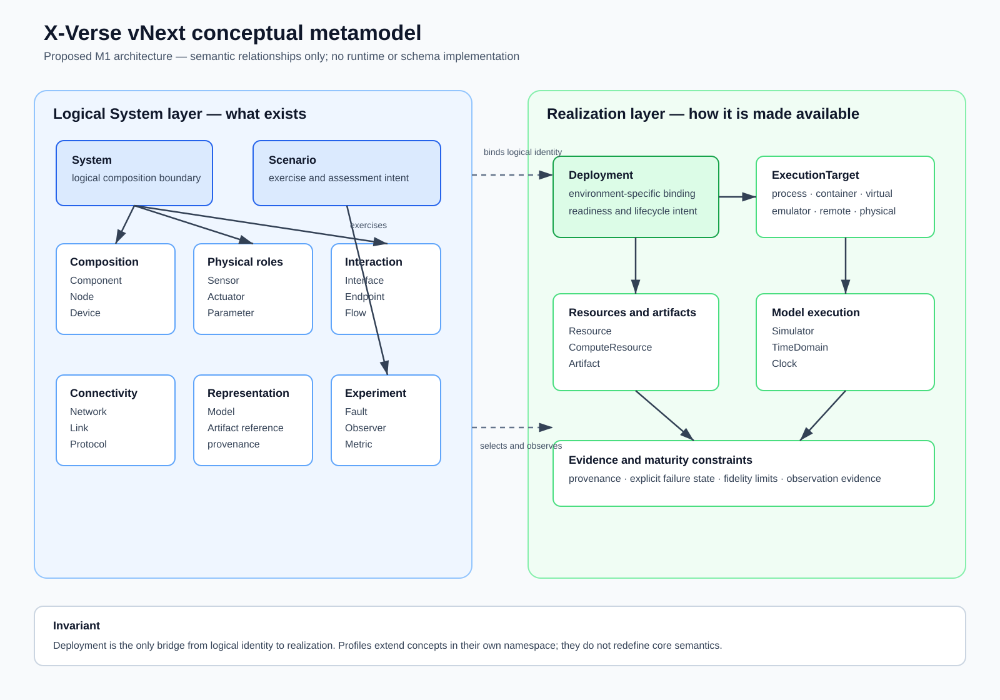

# X-Verse vNext metamodel diagram

**Status**: Approved M1 architecture. This diagram is conceptual and does not define a schema or
runtime class hierarchy.

The SVG above is a standalone rendered diagram for documentation viewers that do not compile Mermaid.
The Mermaid source below remains editable.

\`\`\`mermaid
classDiagram
    class System
    class Scenario
    class Component
    class Node
    class Device
    class Sensor
    class Actuator
    class Interface
    class Endpoint
    class Flow
    class Network
    class Link
    class Protocol
    class Model
    class Artifact
    class ExecutionTarget
    class Simulator
    class TimeDomain
    class Clock
    class Fault
    class Observer
    class Metric
    class Parameter
    class Resource
    class ComputeResource
    class Deployment

    System "1" o-- "0..*" Component : composes
    System "1" o-- "0..*" Node : composes
    System "1" o-- "0..*" Device : identifies
    System "1" o-- "0..*" Interface : declares
    System "1" o-- "0..*" Network : declares
    System "1" o-- "0..*" Model : references
    System "1" o-- "0..*" Parameter : configures
    Component "0..*" --> "0..1" Node : hosted by
    Node "0..*" --> "0..*" Device : represents
    Device "1" --> "0..*" Sensor : has role
    Device "1" --> "0..*" Actuator : has role
    Component "1" o-- "0..*" Endpoint : owns
    Node "1" o-- "0..*" Endpoint : owns
    Device "1" o-- "0..*" Endpoint : owns
    Endpoint "*" --> "1" Interface : exposes
    Flow "1" --> "1" Endpoint : source
    Flow "1" --> "1..*" Endpoint : destination
    Flow "*" --> "1" Interface : carries
    Network "1" o-- "0..*" Link : contains
    Link "*" --> "2..*" Endpoint : connects
    Flow "*" --> "0..*" Link : traverses
    Flow "*" --> "0..*" Protocol : binding
    Model "*" --> "0..*" Artifact : represented by
    Simulator "*" --> "0..*" Model : advances
    TimeDomain "1" o-- "0..*" Clock : contains
    Flow "*" --> "0..1" TimeDomain : ordered in
    Deployment "*" --> "1" System : realizes
    Deployment "*" --> "0..*" Component : binds
    Deployment "*" --> "0..*" Device : binds
    Deployment "*" --> "1..*" ExecutionTarget : selects
    Deployment "*" --> "0..*" Artifact : uses
    Deployment "*" --> "0..*" Resource : requests
    ComputeResource --|> Resource : specializes
    ExecutionTarget "*" --> "0..*" ComputeResource : offers
    Scenario "*" --> "1" System : exercises
    Scenario "*" --> "0..*" Deployment : selects
    Scenario "*" --> "0..*" Fault : injects
    Scenario "*" --> "0..*" Observer : collects
    Observer "*" --> "0..*" Flow : observes
    Metric "*" --> "1..*" Observer : evaluates
    Scenario "*" --> "0..*" Metric : assesses
\`\`\`

The System layer states logical composition. Deployment maps it to a realization. Scenario adds a
bounded experiment and evidence model. Only Deployment crosses from logical identity to an execution
realization; this preserves substitutable simulated, virtual, physical, and hybrid devices.
