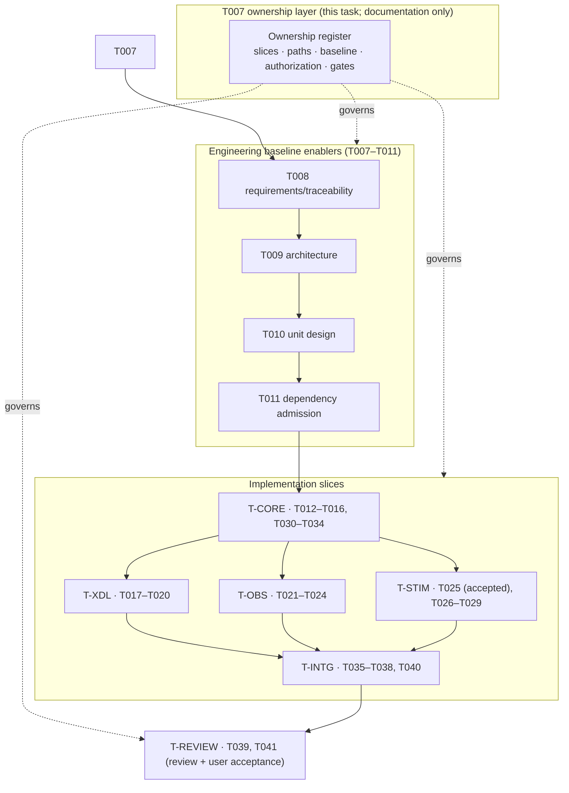

# T007 Architecture — Bounded Task Ownership and Baseline/Authorization Binding

## 1. Document control

| Field | Value |
| --- | --- |
| Task | T007 |
| Stage / role | plan → architecture |
| Revision | 1 |
| Baseline revision | `923a6db65aafbcdbf33a1461e93622777e902deb` |
| Requirement authority | [`requirements.md`](requirements.md) rev 1 |
| Accepted architecture | `specs/007-xcom-core/plan.md` (delivery phases, project structure, decision gates), `specs/007-xcom-core/tasks.md` |
| Governing ADRs | ADR-0018 (platform-first), ADR-0019 (X-COM observation/stimulation ownership), ADR-0020 (repository-owned work products and evidence) |
| Maturity | Governance/planning target; no production or runtime claim |

## 2. Position in the accepted architecture

T007 sits in phase 2 (repository-owned engineering baseline) of capability 007. It is a **governance
layer above** the accepted implementation architecture: it does not add, remove, or reorder any
capability-007 functional component. It decomposes the already-accepted task list into bounded slices,
declares the exact baseline and authorization each slice depends on, fixes exclusive/shared path
ownership, and maps each slice to its evidence and acceptance gate.

**Dependency order.** T005/T006 (accepted) → T007 (this register) → T008 → T009 → T010 → T011 →
{`T-CORE`} → {`T-XDL`, `T-OBS`, `T-STIM`} → `T-INTG` → `T-REVIEW` → T041. The order preserves the
`tasks.md` "Dependencies and execution order" statement: T007–T011 precede production code; T012–T016
establish the core; T017–T020 bind it to XDL; observation and stimulation follow the core; the review
closes the slice.

## 3. Slice decomposition

| Slice | Title | Owning tasks | Depends on |
| --- | --- | --- | --- |
| `T-CORE` | C++ core: contracts, items, diagnostics, providers, routes, loopback, external-tool boundary | T012, T013, T014, T015, T016, T030, T031, T032, T033, T034 | T011 |
| `T-XDL` | XDL compiler: `io.xverse.xcom` Profile v0.1, activation-plan v1, bounded C++ decode | T017, T018, T019, T020 | T-CORE |
| `T-OBS` | Observation boundary: immutable records, bounded taps, synthetic sink | T021, T022, T023, T024 | T-CORE |
| `T-STIM` | Validation stimulation boundary: time authority, permit/session, journal, guard, actions | T025, T026, T027, T028, T029 | T-CORE, T-OBS (shared loopback/sink fixtures) |
| `T-INTG` | Integration, evidence, and documentation | T035, T036, T037, T038, T040 | T-CORE, T-XDL, T-OBS, T-STIM |
| `T-REVIEW` | Independent review and explicit user acceptance | T039, T041 | T-INTG |
| `T-ENABLER` | Engineering-baseline enabler group (not an implementation slice) | T008, T009, T010, T011 | T007 |

`T-CORE` includes the external-tool gateway (T030–T034) because it is X-COM C++ production source and
the provider-neutral external boundary, not a domain or integration artifact. `T-OBS` provides the
synthetic sink that `T-STIM` reuses; that reuse is dependency-ordered, not shared file ownership.

## 4. Ownership boundary model

| Class | Meaning | Rule |
| --- | --- | --- |
| Exclusive path | Owned by exactly one slice | Only the owning slice's tasks may change it; pairwise disjoint across slices under directory-prefix semantics (a trailing `/` marks a directory) |
| Shared path | Build/specification path several slices must edit | Declared in `shared_paths`; one writer at a time, in dependency order, under the owning task's candidate and evidence |
| Prohibited | Never touched by any slice | Legacy The-Xverse repositories, external network peers, TCP listeners, legacy execution, accepted-ADR rewrites, unreviewed payload/credential logs |

Ownership is of **files**, not of the *act* of running them. `T-INTG` may run integration and benchmark
tests whose source files are owned by `T-CORE`, `T-XDL`, `T-OBS`, and `T-STIM`; it may not change those
files without the owning slice's candidate and evidence.

## 5. Path ownership map (current baseline + accepted plan layout)

Paths marked *(planned)* are named by `plan.md`/`tasks.md` but are not yet present in the baseline; they
are reserved to their slice so ownership is fixed before implementation.

| Slice | Exclusive patterns (abridged) | Notes |
| --- | --- | --- |
| `T-CORE` | `src/xverse/xcom/include/xverse/xcom/{contract,core_types,diagnostic,endpoint_route_lifecycle,item,provider,loopback_provider,result,value}.hpp`; `src/xverse/xcom/include/xverse/xcom/tool_gateway.hpp` *(planned)*; `src/xverse/xcom/src/{contract,diagnostic,endpoint_route_lifecycle,item,provider,loopback_provider,core,tool_gateway}.cpp`; `proto/xverse/xcom/v1/tool_gateway.proto` *(planned)*; `tests/xcom/{core_types,endpoint_route_lifecycle,provider_loopback,tool_gateway}/**`; `scripts/validate_xcom_{core_types,endpoint_route_lifecycle,provider_loopback}.py`; per-task `docs/engineering/xcom/t012…t016/`, `t030…t034/` and their queue packages | Data-plane, provider, route, and external-tool boundary |
| `T-XDL` | `xdl/profiles/xcom-v0.1.schema.json` *(planned)*; `src/xverse/xcom/contracts/v1/activation-plan.schema.json` *(planned)*; `src/xverse/xcom/include/xverse/xcom/activation_plan.hpp` *(planned)*; `src/xverse/xcom/src/activation_plan.cpp` *(planned)*; `src/xverse_xdl/xcom_plan.py` *(planned)*; `tests/test_xcom_plan.py` *(planned)*; `tests/xcom/activation_plan/**` *(planned)*; `scripts/validate_xcom_plan.py` *(planned)*; `specs/007-xcom-core/contracts/xdl-profile.md`; per-task `docs/engineering/xcom/t017…t020/` and their queue packages | Non-data-plane compiler edge plus bounded C++ decode |
| `T-OBS` | `src/xverse/xcom/include/xverse/xcom/observation.hpp`; `src/xverse/xcom/src/observation.cpp`; `tests/xcom/observation/**`; `scripts/validate_xcom_observation.py`; per-task `docs/engineering/xcom/t021…t024/` and their queue packages | Passive, bounded observation boundary |
| `T-STIM` | `src/xverse/xcom/include/xverse/xcom/validation_session.hpp`; `src/xverse/xcom/include/xverse/xcom/stimulation_journal.hpp` *(planned)*; `src/xverse/xcom/src/validation_session.cpp`; `src/xverse/xcom/src/stimulation_journal.cpp` *(planned)*; `tests/xcom/{validation_session,stimulation_journal}/**`; `scripts/check_xcom_t025_test_dependencies.py`; the whole `docs/engineering/xcom/t025/` task directory (including its `acceptance-decision.md`); per-task `docs/engineering/xcom/t026…t029/` and all their queue packages | Permit/session, journal, guard, actions; per-task artifacts follow the owning task, so the T025 acceptance record belongs to this slice |
| `T-INTG` | `docs/engineering/xcom/build-environment.md`; `docs/engineering/xcom/dependency-lock.md`; `scripts/xcom_dependency_preflight.py`; `scripts/check_doxygen.py`; `docs/xcom/**` *(planned)*; `specs/007-xcom-core/reference-traceability.md`; per-task `docs/engineering/xcom/t035…t038/`, `t040/` and their queue packages | Dependency admission, integration evidence, docs, traceability; queue packages are per-task, so this slice does not own the whole `reports/xcom-queue/` directory |
| `T-REVIEW` | `docs/reviews/**`; per-task `docs/engineering/xcom/t039/`, `t041/` and their queue packages | Capability-level review reports plus its own task artifacts; the per-task `internal-review.json`/`acceptance-decision.md` of another task is **not** owned here |
| `T-ENABLER` | `specs/007-xcom-core/{spec,plan,data-model,research,quickstart,analysis}.md`; `specs/007-xcom-core/checklists/**`; `specs/007-xcom-core/contracts/**`; `docs/adr/**` (new ADR only); the whole `docs/engineering/xcom/t007/` directory (the producing task's work products, including `internal-review.json` and `acceptance-decision.md`); per-task `docs/engineering/xcom/t008…t011/` and all their queue packages | Requirements, architecture, unit design, dependency admission; new ADR required to change an accepted ADR |

**Per-task artifact rule.** The per-task work-product directory `docs/engineering/xcom/<task>/` and the
queue package `reports/xcom-queue/<task>-package.json` are produced by that task's own workflow run, so each
is reserved exclusively to the slice that owns the task. The producing task T007 is the exception fixed by
`detailed-design.md`: its directory and queue package are reserved to `T-ENABLER`, the first slice that
consumes them, and `T-ENABLER` depends only on T007, so the reservation is satisfied at the stage that
writes the artifact. This rule gives every one of `docs/engineering/xcom/t007/internal-review.json`,
`docs/engineering/xcom/t007/acceptance-decision.md`, and `reports/xcom-queue/t007-package.json` exactly one
owner and removes the earlier `docs/engineering/xcom/t007/**` vs
`docs/engineering/xcom/*/internal-review.json` double assignment.

**Shared (serialized) paths** — declared in `shared_paths` and edited one writer at a time in dependency
order:

- `CMakeLists.txt` (root)
- `src/xverse/xcom/CMakeLists.txt`
- `cmake/XComWarnings.cmake`, `cmake/XComOfflineDependencies.cmake`
- `specs/007-xcom-core/tasks.md` (per-task checkbox/state updates only)
- `docs/engineering/xcom/t007/task-ownership.md` and `task-ownership.json` (T007-owned; amended only by a
  successor candidate that re-runs the ownership validation)

**Prohibited for every slice:** every path outside this repository (in particular any The-Xverse legacy
repository); any network peer, socket, or TCP listener; any legacy binary execution; any accepted-ADR
rewrite; any credential, private address, unrestricted payload, or sensitive deployment value in public
evidence.

## 6. Baseline and authorization binding model

- **Authorized baseline**: every slice binds to `923a6db65aafbcdbf33a1461e93622777e902deb` (validated by
  `git rev-parse`). No tag, branch, or ambient state is a valid baseline.
- **Candidate revision rule**: each candidate records its own exact revision and its accepted predecessor
  revision; acceptance is per candidate and never inherited from a sibling or from source presence.
- **Authorization references**: ACC001–ACC015 (design acceptance, bounded implementation authorization,
  and the ACC015 workflow amendment), ADR-0018, ADR-0019, and ADR-0020. A slice must cite at least one
  resolvable reference.
- **Safety boundary** (from ACC011/ACC014 and the spec exclusions): no legacy adapter/execution,
  external peer, TCP listener, physical bus, deployment, or compatibility claim.
- **Review/acceptance**: independent read-only review (T039) before explicit user acceptance (T041);
  T007 neither performs nor presumes either.

## 7. Build and verification integration

- T007 changes documentation only: `docs/engineering/xcom/t007/**`, the canonical register under
  `docs/engineering/xcom/`, and (implementation stage) an entry in
  `specs/007-xcom-core/tasks.md`. It adds no CMake target and no test target.
- The register validator is a repository-owned script under `scripts/` (allowed; not `src/`, `tests/`,
  or `xdl/`). It is an offline static checker, not a C++/runtime test.
- The deterministic gate for T007 is
  `python3 /home/jefferson/x-verse_fabric/automation/xcom_feature_gate.py verify T007 923a6db…`; it
  requires the six work products, the T007 checkbox state, a docs-only diff, and `git diff --check`
  (see `verification-plan.md` §2).

**Affected paths and bounds.** The T007 candidate affects only its work products, the canonical
register, and the validator (see `detailed-design.md` §2); no `src/`, `tests/`, or `xdl/` path changes.
T007 has no runtime concurrency; the validator is offline, single-threaded, bounded (≤ 4 MiB input,
≤ 60 s, no network), and deterministic. Negative cases are the register defects NEG-01..NEG-20 in
`verification-plan.md` §4; each new check added by the successor candidate has a fixture that isolates it.

## 8. Constitution and ADR check

| Check | Assessment |
| --- | --- |
| Production safety | No legacy repository or process is touched; the register prohibits it per slice. |
| Domain neutrality | Slices are protocol- and domain-neutral; no ECU/CAN/SOME/IP primitive is introduced. |
| XDL centrality | The XDL slice owns the `io.xverse.xcom` Profile and activation plan; no competing language. |
| Standards interoperability | The dependency-admission slice pins standards-based dependencies; no replacement is claimed. |
| Logical/physical separation | Ownership is over logical artifacts; no realization is bound. |
| Physical hardware as first-class | Not changed; the stimulation slice retains the time-authority boundary. |
| Platform before compatibility | Platform-first ordering is preserved by the dependency graph. |
| Blueprint isolation | No reverse dependency; blueprint/domain work remains outside capability 007. |
| Explicit fidelity | Maturity labels distinguish accepted, unreconciled, allocated, and deferred work. |
| Reproducibility/traceability | Exact baseline/authorization binding, deterministic serialization, offline validation, and requirement trace in §9. |
| Capability acceptance gates | Evidence/review/acceptance gates are mapped per slice; no gate is removed or weakened. |
| ADR-0018/0019/0020 | Platform-first sequencing, X-COM observation/stimulation ownership, and repository-owned exact-candidate evidence are preserved. |

## 9. Requirement-to-component trace

| Requirement | Components / artifacts | Planned evidence |
| --- | --- | --- |
| T007-STK-001..007 | Register + validator (`U-REGISTER`, `U-SLICE`, `U-BIND`, `U-DEPS`, `U-PATHS`, `U-EVID`, `U-RECON`, `U-SAFE`, `U-VALIDATE`) | CHK-01..CHK-15 |
| T007-SR-001 | `U-REGISTER` | CHK-01, CHK-09 |
| T007-SR-002 | `U-SLICE` | CHK-02, NEG-01, NEG-02 |
| T007-SR-003 | `U-SLICE`, `U-REGISTER` | CHK-03, NEG-03, NEG-04 |
| T007-SR-004 | `U-BIND` | CHK-04, NEG-05 |
| T007-SR-005 | `U-BIND` | CHK-04, NEG-06 |
| T007-SR-006 | `U-PATHS` | CHK-05, CHK-15, NEG-07, NEG-08, NEG-18, NEG-19, NEG-20 |
| T007-SR-007 | `U-PATHS` | CHK-08 |
| T007-SR-008 | `U-DEPS` | CHK-06, NEG-09, NEG-10, NEG-14, NEG-15, NEG-16 |
| T007-SR-009 | `U-EVID` | CHK-07, NEG-11 |
| T007-SR-010 | `U-SAFE` | CHK-10, NEG-12, NEG-17 |
| T007-SR-011 | `U-RECON` | CHK-11, NEG-13 |
| T007-SR-012 | `U-VALIDATE` | CHK-09, CHK-14, `--self-test` |
| T007-SR-013 | build/gate integration | CHK-12, gate step |
| T007-SR-014 | `U-SAFE` | CHK-13 |
