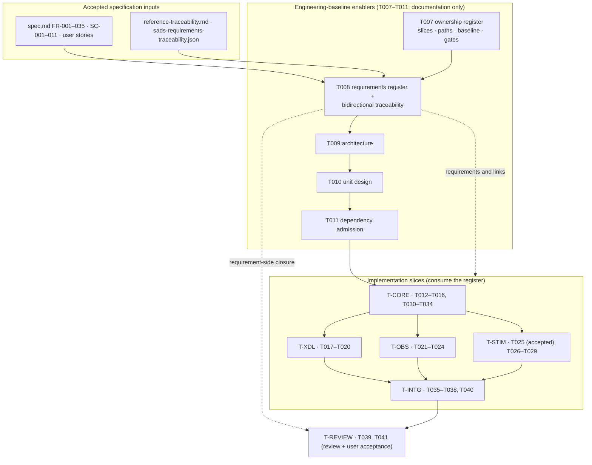

# T008 Architecture — Requirement Register and Bidirectional Traceability

## 1. Document control

| Field | Value |
| --- | --- |
| Task | T008 |
| Stage / role | plan → architecture |
| Revision | 1 |
| Baseline revision | `957a60723f99c3a31efba1cbd137c454c4acb462` |
| Requirement authority | [`requirements.md`](requirements.md) rev 1 |
| Accepted architecture | `specs/007-xcom-core/plan.md` (delivery phases, project structure, decision gates), `specs/007-xcom-core/spec.md`, `specs/007-xcom-core/tasks.md` |
| Governing ADRs | ADR-0018 (platform-first), ADR-0019 (X-COM observation/stimulation ownership), ADR-0020 (repository-owned work products and evidence) |
| Consumes | `docs/engineering/xcom/task-ownership.{md,json}` (T007), `specs/007-xcom-core/reference-traceability.md`, `docs/architecture/sads-requirements-traceability.json` |
| Maturity | Governance/planning target; no production or runtime claim |

## 2. Position in the accepted architecture

T008 sits in phase 2 (repository-owned engineering baseline) of capability 007, immediately after T007
(task ownership) and before T009 (architecture), T010 (unit design), and T011 (dependency admission). It
is a **requirements and traceability layer** over the accepted implementation architecture: it does not
add, remove, or reorder any capability-007 functional component. It converts the accepted specification,
plan, ownership register, and REF-002 allocation into one canonical requirement register plus one
bidirectional traceability matrix that the later slices consume and extend.



**Dependency order.** T005/T006 (accepted) → T007 (ownership register) → T008 (this register) → T009 →
T010 → T011 → `T-CORE` → {`T-XDL`, `T-OBS`, `T-STIM`} → `T-INTG` → `T-REVIEW` → T041. The order preserves
the `tasks.md` "Dependencies and execution order" statement: T007–T011 precede production code; T012–T016
establish the core; T017–T020 bind it to XDL; observation and stimulation follow the core; the review
closes the slice.

## 3. Artifact decomposition

| Artifact | Path | Stage | Owner | Purpose |
| --- | --- | --- | --- | --- |
| Requirements (plan) | `docs/engineering/xcom/t008/{requirements,architecture,detailed-design,unit-specifications,verification-plan}.md` | plan | T008 / `T-ENABLER` | This bounded design package |
| Requirements register (machine) | `docs/engineering/xcom/t008/requirements-register.json` | implementation | T008 / `T-ENABLER` | Canonical STK/SYS/SW model and REF-002 dispositions |
| Requirements register (human) | `docs/engineering/xcom/t008/requirements-register.md` | implementation | T008 / `T-ENABLER` | Deterministic projection of the JSON model |
| Traceability matrix (machine) | `docs/engineering/xcom/t008/traceability-matrix.json` | implementation | T008 / `T-ENABLER` | Canonical links, artifacts, and measures |
| Traceability matrix (human) | `docs/engineering/xcom/t008/traceability-matrix.md` | implementation | T008 / `T-ENABLER` | Deterministic projection of the JSON matrix |
| Register/matrix validator | `scripts/validate_xcom_requirements_traceability.py` | implementation | T008 / `T-ENABLER` | Offline, deterministic, bounded checks with a self-test |
| Implementation record | `docs/engineering/xcom/t008/implementation.md` | implementation | T008 / `T-ENABLER` | Candidate revision, commands, outcomes, limitations |
| Capability task state | `specs/007-xcom-core/tasks.md` | implementation | shared | Mark T008 complete only in the implementation stage |
| Ownership consistency | `docs/engineering/xcom/task-ownership.{json,md}` | implementation | shared | Record the new validator path in `T-ENABLER` and re-validate |

The five plan-stage work products are documentation; they are produced before this implementation. The
implementation adds the register, the matrix, the validator, and the record. No `src/`, `tests/`, or
`xdl/` path is created or changed.

## 4. Requirement and traceability model

### 4.1 Requirement levels

| Level | Family | Cardinality | Derivation rule |
| --- | --- | --- | --- |
| Stakeholder | `XCOM-STK-###` | 8 | Derived from the accepted spec user stories (US1–US4), success-criteria groups, and safety obligations. |
| System (functional) | `XCOM-SYS-FR-###` | 35 | One-to-one with accepted `FR-001`–`FR-035`; anchored to the accepted identity. |
| System (success criterion) | `XCOM-SYS-SC-###` | 11 | One-to-one with accepted `SC-001`–`SC-011`; states the measurable outcome. |
| Software | `XCOM-SW-<FAMILY>-###` | family-defined | Refines ≥1 system requirement; `FAMILY ∈ {CORE, GW, XDL, OBS, STIM, INTG, ENB}`. |

Software families map to the T007 slices:

| Family | Slice | Owning tasks |
| --- | --- | --- |
| `XCOM-SW-CORE` | `T-CORE` | T012–T016 |
| `XCOM-SW-GW` | `T-CORE` (external-tool boundary) | T030–T034 |
| `XCOM-SW-XDL` | `T-XDL` | T017–T020 |
| `XCOM-SW-OBS` | `T-OBS` | T021–T024 |
| `XCOM-SW-STIM` | `T-STIM` | T025–T029 |
| `XCOM-SW-INTG` | `T-INTG` | T035–T038, T040 |
| `XCOM-SW-ENB` | `T-ENABLER` | T008–T011 |

### 4.2 Traceability chain

```text
spec FR-### / SC-###  ──derives_from──▶  XCOM-SYS-FR/SC-###
XCOM-STK-###          ◀──refines──────    XCOM-SYS-FR/SC-###
XCOM-SYS-FR/SC-###    ◀──refines──────    XCOM-SW-<FAMILY>-###
XCOM-SW-<FAMILY>-###  ──allocated_to──▶   design unit (planned or T009/T010-declared)
XCOM-SW-<FAMILY>-###  ──implemented_by──▶ source path/symbol   (established only with an exact revision)
XCOM-SW-<FAMILY>-###  ──verified_by────▶  test id
XCOM-SW-<FAMILY>-###  ──evidenced_by───▶  measure / evidence id
XVE-SYS-0139..0158    ◀──covers─────────  XCOM-SYS-FR/SC-###   (applied targets only)
```

Every arrow is stored once in the matrix and is traversable in both directions by resolution against the
register and the declared artifact/journal indexes. No arrow is inferred from prose.

### 4.3 Link relations and target kinds (closed sets)

| Relation | Meaning |
| --- | --- |
| `refines` | Child requirement elaborates a parent requirement. |
| `derives_from` | System requirement is derived from an accepted spec `FR-###`/`SC-###`. |
| `allocated_to` | Requirement is allocated to a design unit or planned artifact. |
| `implemented_by` | Requirement is implemented by a source path/symbol at an exact revision. |
| `verified_by` | Requirement is verified by a named test. |
| `evidenced_by` | Requirement is supported by a verification measure or evidence record. |

| Target kind | Resolution store |
| --- | --- |
| `requirement` | Register `requirements[]` |
| `sads` | REF-002 disposition set in the register |
| `design_unit` | Matrix `artifacts[]` (kind `design_unit`) |
| `source` | Matrix `artifacts[]` (kind `source`); the path is checked against the tree or marked `planned` |
| `test` | Matrix `artifacts[]` (kind `test`) |
| `measure` | Matrix `artifacts[]` (kind `measure`) |
| `evidence` | Matrix `artifacts[]` (kind `evidence`) |

## 5. Product paths the register links to

These are the real or planned product paths the matrix anchors. T008 **links** to them; it does not change
them. Paths marked *(planned)* are named by the accepted plan/tasks and are not yet present in the
baseline.

| Family | Anchored product paths |
| --- | --- |
| `XCOM-SW-CORE` | `src/xverse/xcom/include/xverse/xcom/{contract,core_types,diagnostic,endpoint_route_lifecycle,item,provider,loopback_provider,result,value}.hpp`; `src/xverse/xcom/src/{contract,diagnostic,endpoint_route_lifecycle,item,provider,loopback_provider,value}.cpp`; `tests/xcom/{core_types,endpoint_route_lifecycle,provider_loopback}/**` |
| `XCOM-SW-GW` | `proto/xverse/xcom/v1/tool_gateway.proto` *(planned)*; `src/xverse/xcom/include/xverse/xcom/tool_gateway.hpp` *(planned)*; `src/xverse/xcom/src/tool_gateway.cpp` *(planned)*; `tests/xcom/tool_gateway/**` *(planned)* |
| `XCOM-SW-XDL` | `xdl/profiles/xcom-v0.1.schema.json` *(planned)*; `src/xverse/xcom/contracts/v1/activation-plan.schema.json` *(planned)*; `src/xverse/xcom/include/xverse/xcom/activation_plan.hpp` *(planned)*; `src/xverse/xcom/src/activation_plan.cpp` *(planned)*; `src/xverse_xdl/xcom_plan.py` *(planned)*; `tests/test_xcom_plan.py` *(planned)*; `tests/xcom/activation_plan/**` *(planned)* |
| `XCOM-SW-OBS` | `src/xverse/xcom/include/xverse/xcom/observation.hpp`; `src/xverse/xcom/src/observation.cpp`; `tests/xcom/observation/**` |
| `XCOM-SW-STIM` | `src/xverse/xcom/include/xverse/xcom/validation_session.hpp`; `src/xverse/xcom/src/validation_session.cpp`; `src/xverse/xcom/include/xverse/xcom/stimulation_journal.hpp` *(planned)*; `src/xverse/xcom/src/stimulation_journal.cpp` *(planned)*; `tests/xcom/{validation_session,stimulation_journal}/**` |
| `XCOM-SW-INTG` | `docs/xcom/**` *(planned)*; `docs/engineering/xcom/t035…t038/`, `t040/` *(planned)*; `specs/007-xcom-core/reference-traceability.md` |
| `XCOM-SW-ENB` | `docs/engineering/xcom/t007/**`; `docs/engineering/xcom/t008/**`; `docs/engineering/xcom/t009…t011/**` *(planned)*; `docs/engineering/xcom/task-ownership.{json,md}`; `docs/engineering/xcom/{build-environment,dependency-lock}.md` *(planned)* |

Per the T007 per-task artifact rule, each task's `docs/engineering/xcom/<task>/` directory and
`reports/xcom-queue/<task>-package.json` remain reserved to the owning slice; T008 does not claim any other
task's artifacts.

## 6. Baseline, authorization, and ownership binding

- **Authorized baseline**: T008 binds to `957a60723f99c3a31efba1cbd137c454c4acb462` (validated by
  `git rev-parse`). No tag, branch, or ambient state is a valid baseline. Every inherited T007 slice
  baseline (`923a6db…`) remains a historical predecessor binding and is not overwritten.
- **Candidate revision rule**: each candidate records its own exact revision and its accepted predecessor
  revision; acceptance is per candidate and never inherited from a sibling or from source presence.
- **Authorization references**: ACC001–ACC015 (design acceptance, bounded implementation authorization,
  and the ACC015 workflow amendment), ADR-0018, ADR-0019, and ADR-0020.
- **Safety boundary** (from ACC011/ACC014 and the spec exclusions): no legacy adapter/execution, external
  peer, TCP listener, physical bus, deployment, or compatibility claim.
- **Ownership binding**: T008 belongs to the `T-ENABLER` slice (T007 assignment). Its new artifacts are
  declared under `docs/engineering/xcom/t008/` (already exclusive to `T-ENABLER`) and one new script
  `scripts/validate_xcom_requirements_traceability.py`, recorded for `T-ENABLER` in the T007 register.
- **Review/acceptance**: independent read-only review (T039) before explicit user acceptance (T041). T008
  neither performs nor presumes either.

## 7. Build and verification integration

- T008 changes documentation/governance only plus one script under `scripts/`: `docs/engineering/xcom/t008/**`,
  `scripts/validate_xcom_requirements_traceability.py`, an entry in `specs/007-xcom-core/tasks.md`
  (implementation stage), and the T007 ownership-register consistency update. It adds no CMake target and
  no CTest test.
- The register validator is a repository-owned Python 3.11-compatible script under `scripts/` (allowed;
  not `src/`, `tests/`, or `xdl/`). It is an offline static checker, not a C++/runtime test.
- The deterministic gate for T008 is
  `python3 /home/jefferson/x-verse_fabric/automation/xcom_feature_gate.py verify T008 957a607…`; it
  requires the six work products, the T008 checkbox state, a docs-only diff (excluding `scripts/`, which
  is permitted), and `git diff --check` (see `verification-plan.md` §2).

**Affected paths and bounds.** The T008 candidate affects only its work products, the register and matrix,
the validator, and the ownership-register consistency update (see `detailed-design.md` §2 and §5); no
`src/`, `tests/`, or `xdl/` path changes. T008 has no runtime concurrency; the validator is offline,
single-threaded, bounded (≤ 1 MiB per file, ≤ 4 MiB total, ≤ 60 s, no network), and deterministic.
Negative cases are the register/matrix defects NEG-01..NEG-28 in `verification-plan.md` §4; each new check
added by the candidate has a fixture that isolates it, including system-text fidelity (NEG-24), declared
matrix ordering/uniqueness (NEG-25..NEG-27), and the fail-closed reconciliation dependency (NEG-28).

## 8. Constitution and ADR check

| Check | Assessment |
| --- | --- |
| Production safety | No legacy repository or process is touched; the register/policy rows prohibit it. |
| Domain neutrality | Requirements and families are protocol- and domain-neutral; no ECU/CAN/SOME/IP primitive is introduced. |
| XDL centrality | The XDL family owns the `io.xverse.xcom` Profile and activation plan; no competing language is registered. |
| Standards interoperability | REF-002 dispositions are recorded, not re-decided; no replacement is claimed. |
| Logical/physical separation | Requirements keep logical identity separate from realization; no realization is bound. |
| Physical hardware as first-class | Not changed; the stimulation family retains the time-authority boundary. |
| Platform before compatibility | Platform-first ordering is preserved by the linked task set and dependency graph. |
| Blueprint isolation | No reverse dependency; blueprint/domain work remains outside capability 007. |
| Explicit fidelity | Maturity labels distinguish implemented, partial, allocated, deferred, and unreconciled work; source presence is never acceptance. |
| Reproducibility/traceability | Exact baseline/authorization binding, deterministic serialization, offline validation, and full requirement trace in §9. |
| Capability acceptance gates | Requirement-side evidence/review/acceptance gates are mapped; no gate is removed or weakened. |
| ADR-0018/0019/0020 | Platform-first sequencing, X-COM observation/stimulation ownership, and repository-owned exact-candidate evidence are preserved. |

## 9. Requirement-to-component trace

| Requirement | Components / artifacts | Planned evidence |
| --- | --- | --- |
| T008-STK-001 | Register model (`U-ID`, `U-STK`, `U-SYS`) | CHK-02..CHK-06 |
| T008-STK-002 | Binding records (`U-BIND`) | CHK-11, NEG-18, BND-02 |
| T008-STK-003 | Traceability matrix (`U-TRACE`, `U-SW`) | CHK-08, CHK-09, NEG-12..NEG-14 |
| T008-STK-004 | REF-002 table (`U-REF002`) | CHK-07, NEG-10, NEG-11 |
| T008-STK-005 | Maturity labels (`U-MAT`) | CHK-10, NEG-15..NEG-17 |
| T008-STK-006 | Register + matrix + validator (`U-REG`, `U-SAFE`, `U-VALIDATE`) | CHK-12, CHK-13, DET-01..DET-04 |
| T008-STK-007 | Boundary rule (`U-SAFE`, `U-VALIDATE`) | CHK-14, CHK-15, BND-01 |
| T008-STK-008 | Review/acceptance preservation (`U-SAFE`) | CHK-14; no acceptance claim |
| T008-SR-001 | `U-REG` | CHK-01, CHK-12 |
| T008-SR-002 | `U-ID` | CHK-02, NEG-02, NEG-03 |
| T008-SR-003 | `U-SYS` | CHK-03, NEG-04, NEG-05 |
| T008-SR-004 | `U-SYS` | CHK-04, NEG-06 |
| T008-SR-005 | `U-STK`, `U-SW` | CHK-05, CHK-06, NEG-07..NEG-09 |
| T008-SR-006 | `U-REF002` | CHK-07, NEG-10, NEG-11 |
| T008-SR-007 | `U-TRACE` | CHK-08, NEG-12, NEG-13 |
| T008-SR-008 | `U-TRACE` | CHK-09, NEG-14 |
| T008-SR-009 | `U-MAT` | CHK-10, NEG-15..NEG-17 |
| T008-SR-010 | `U-BIND` | CHK-11, NEG-18 |
| T008-SR-011 | boundary rule | CHK-14, BND-01, deterministic gate |
| T008-SR-012 | `U-SAFE` | CHK-13, NEG-20 |
| T008-SR-013 | `U-VALIDATE` | CHK-12, CHK-15, `--self-test` |
