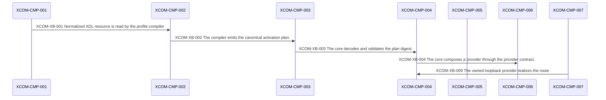
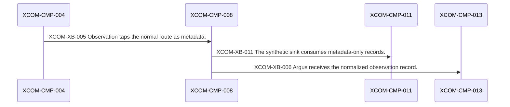
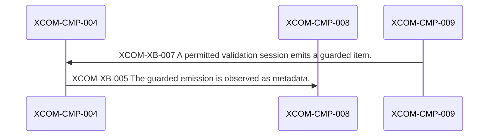
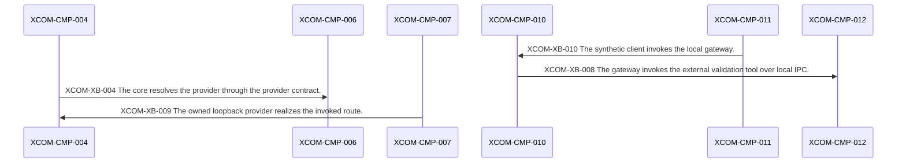

# X-COM Architecture Contract Model — Deterministic Projection

> Generated deterministically from `architecture-model.json` (schema version 1)
> by `scripts/validate_xcom_architecture_contracts.py`. Do not edit by hand; run
> `--check-human` to confirm this projection is exact.

## 1. Identity

| Field | Value |
| --- | --- |
| Task | T009 |
| Capability | 007-xcom-core |
| Baseline revision | `209084b11a211273f815980f753ba728e1251a09` |
| Candidate revision rule | Every candidate records its own exact revision and the exact accepted predecessor revision it derives from; acceptance is per candidate and is never inherited from a sibling or inferred from source presence. |
| Components | 13 |
| Boundaries | 11 |
| Contracts | 6 |
| Diagrams | 5 |
| Invariants | 15 |
| REF-002 disposition | unchanged (promoted: 0) |

## 2. Components

| Id | Name | Layer | Language | Scope | Owning slice | Maturity |
| --- | --- | --- | --- | --- | --- | --- |
| XCOM-CMP-001 | Normalized XDL input | xdl-input | python | first-proof | T-XDL | partial |
| XCOM-CMP-002 | X-COM Profile and plan compiler | build-time | python | first-proof | T-XDL | allocated |
| XCOM-CMP-003 | Canonical activation plan | derived-artifact | json | first-proof | T-XDL | allocated |
| XCOM-CMP-004 | Core value, contract, and diagnostic types | data-plane | cpp | first-proof | T-CORE | partial |
| XCOM-CMP-005 | Endpoint and route lifecycle | data-plane | cpp | first-proof | T-CORE | partial |
| XCOM-CMP-006 | Provider boundary and composition | data-plane | cpp | first-proof | T-CORE | partial |
| XCOM-CMP-007 | Owned loopback provider | test-fixture | cpp | first-proof | T-CORE | partial |
| XCOM-CMP-008 | Observation boundary | boundary | cpp | first-proof | T-OBS | partial |
| XCOM-CMP-009 | Validation stimulation session | boundary | cpp | first-proof | T-STIM | implemented |
| XCOM-CMP-010 | Local tool gateway | edge | cpp | first-proof | T-CORE | allocated |
| XCOM-CMP-011 | Synthetic sink and tools | test-fixture | cpp | first-proof | T-OBS | partial |
| XCOM-CMP-012 | External validation tool | external | external | later | external | allocated |
| XCOM-CMP-013 | Argus observation adapter | downstream | external | later | downstream | allocated |

## 3. Boundaries

| Id | Kind | From → To | Languages | Direction | Contract | Authorization | Scope | Maturity |
| --- | --- | --- | --- | --- | --- | --- | --- | --- |
| XCOM-XB-001 | data | XCOM-CMP-001 → XCOM-CMP-002 | python → python | one-way | XCOM-XLC-005 | none | first-proof | partial |
| XCOM-XB-002 | artifact | XCOM-CMP-002 → XCOM-CMP-003 | python → json | one-way | XCOM-XLC-001 | none | first-proof | allocated |
| XCOM-XB-003 | language | XCOM-CMP-003 → XCOM-CMP-004 | json → cpp | one-way | XCOM-XLC-001 | plan-digest-bound | first-proof | allocated |
| XCOM-XB-004 | in-process | XCOM-CMP-004 → XCOM-CMP-006 | cpp → cpp | bidirectional | XCOM-XLC-004 | exact-handle-required | first-proof | partial |
| XCOM-XB-005 | in-process | XCOM-CMP-004 → XCOM-CMP-008 | cpp → cpp | one-way | XCOM-XLC-003 | tap-policy-required | first-proof | partial |
| XCOM-XB-006 | trust | XCOM-CMP-008 → XCOM-CMP-013 | cpp → cpp | one-way | XCOM-XLC-003 | none | later | allocated |
| XCOM-XB-007 | in-process | XCOM-CMP-009 → XCOM-CMP-004 | cpp → cpp | bidirectional | XCOM-XLC-006 | validation-permit-required | first-proof | implemented |
| XCOM-XB-008 | ipc | XCOM-CMP-010 → XCOM-CMP-012 | protobuf → external | bidirectional | XCOM-XLC-002 | validation-permit-required | later | allocated |
| XCOM-XB-009 | realization | XCOM-CMP-007 → XCOM-CMP-004 | cpp → cpp | bidirectional | XCOM-XLC-004 | exact-handle-required | first-proof | partial |
| XCOM-XB-010 | ipc | XCOM-CMP-011 → XCOM-CMP-010 | protobuf → cpp | bidirectional | XCOM-XLC-002 | validation-permit-required | first-proof | allocated |
| XCOM-XB-011 | trust | XCOM-CMP-008 → XCOM-CMP-011 | cpp → cpp | one-way | XCOM-XLC-003 | none | first-proof | partial |

## 4. Contracts

| Id | Kind | Version | Canonical artifact | Unknown-field policy | Maturity |
| --- | --- | --- | --- | --- | --- |
| XCOM-XLC-001 | cross-language-schema | v1 | src/xverse/xcom/contracts/v1/activation-plan.schema.json | fail-closed | allocated |
| XCOM-XLC-002 | external-rpc | v1 | proto/xverse/xcom/v1/tool_gateway.proto | fail-closed | allocated |
| XCOM-XLC-003 | in-process-cpp | v1 | src/xverse/xcom/include/xverse/xcom/observation.hpp | n/a | partial |
| XCOM-XLC-004 | in-process-cpp | v1 | src/xverse/xcom/include/xverse/xcom/provider.hpp | n/a | partial |
| XCOM-XLC-005 | schema | v1alpha1 | xdl/schemas/v1alpha1/xdl.schema.json | fail-closed | partial |
| XCOM-XLC-006 | in-process-cpp | v1 | src/xverse/xcom/include/xverse/xcom/validation_session.hpp | fail-closed | implemented |

## 5. Invariants

| Id | Kind | Statement | Enforcement |
| --- | --- | --- | --- |
| XCOM-INV-01 | data-model | Logical identity never depends on a provider address or a handle. | CHK-09 |
| XCOM-INV-02 | data-model | No endpoint, route, tap, or session is mutable without its exact issued handle. | CHK-09 |
| XCOM-INV-03 | data-model | Synthetic origin survives routing and observation. | CHK-09 |
| XCOM-INV-04 | data-model | At most one permitted service-emulation owner exists per endpoint and session. | CHK-09 |
| XCOM-INV-05 | data-model | All queues and quotas are finite with declared overflow behaviour. | CHK-09 |
| XCOM-INV-06 | data-model | Metadata-only observation contains no payload bytes. | CHK-09 |
| XCOM-INV-07 | data-model | Every activation and stimulation decision is bound to the exact plan digest. | CHK-09 |
| XCOM-INV-08 | safety | Local tool transport access never replaces validation-permit checks. | CHK-09 |
| XCOM-INV-09 | data-model | Scheduled requests never compare or order unmapped clock domains. | CHK-09 |
| XCOM-INV-10 | data-model | One endpoint generation has at most one active service-emulation lease. | CHK-09 |
| XCOM-INV-11 | dependency | Dependencies flow one-way from blueprints to domain profiles to XDL/platform APIs to runtime abstractions. | CHK-08 |
| XCOM-INV-12 | neutrality | Core components contain no domain-specific primitive. | CHK-08 |
| XCOM-INV-13 | safety | The first proof exposes no TCP listener except the host-protected local tool gateway. | CHK-09 |
| XCOM-INV-14 | architecture | Python is confined to the xdl-input and build-time layers; the data plane is C++. | CHK-08 |
| XCOM-INV-15 | safety | The first proof executes no legacy workload and contacts no external network peer. | CHK-09 |

## 6. Diagrams

### XCOM-DGM-001 — X-COM first-proof component view

- Kind: `component`
- User story: `-`

```mermaid
flowchart TB
  XCOM_CMP_001["XCOM-CMP-001 Normalized XDL input"]
  XCOM_CMP_002["XCOM-CMP-002 X-COM Profile and plan compiler"]
  XCOM_CMP_003["XCOM-CMP-003 Canonical activation plan"]
  XCOM_CMP_004["XCOM-CMP-004 Core value, contract, and diagnostic types"]
  XCOM_CMP_005["XCOM-CMP-005 Endpoint and route lifecycle"]
  XCOM_CMP_006["XCOM-CMP-006 Provider boundary and composition"]
  XCOM_CMP_007["XCOM-CMP-007 Owned loopback provider"]
  XCOM_CMP_008["XCOM-CMP-008 Observation boundary"]
  XCOM_CMP_009["XCOM-CMP-009 Validation stimulation session"]
  XCOM_CMP_010["XCOM-CMP-010 Local tool gateway"]
  XCOM_CMP_011["XCOM-CMP-011 Synthetic sink and tools"]
  XCOM_CMP_012["XCOM-CMP-012 External validation tool"]
  XCOM_CMP_013["XCOM-CMP-013 Argus observation adapter"]
```

### XCOM-DGM-002 — Plan compilation to activation sequence

- Kind: `sequence`
- User story: `US1`

### XCOM-DGM-003 — Observation and downstream sequence

- Kind: `sequence`
- User story: `US2`

### XCOM-DGM-004 — Validation stimulation sequence

- Kind: `sequence`
- User story: `US3`

### XCOM-DGM-005 — Local tool gateway and external tool sequence

- Kind: `sequence`
- User story: `US4`

