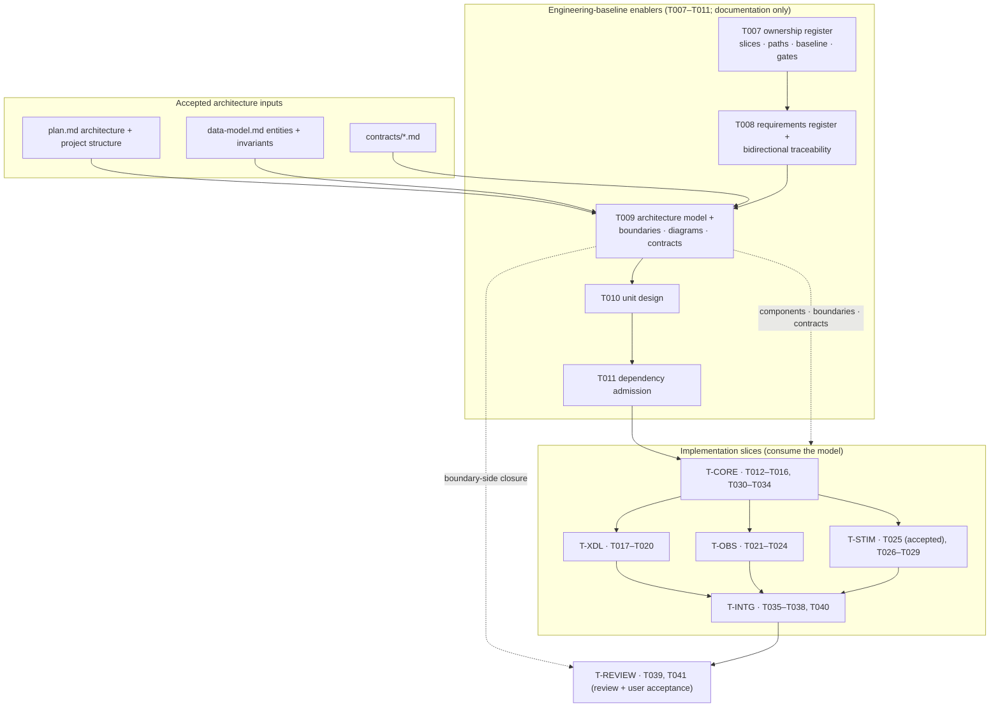

# T009 Architecture — Component, Boundary, Diagram, and Cross-Language Contract Model

## 1. Document control

| Field | Value |
| --- | --- |
| Task | T009 |
| Stage / role | plan → architecture |
| Revision | 1 |
| Baseline revision | `209084b11a211273f815980f753ba728e1251a09` |
| Requirement authority | [`requirements.md`](requirements.md) rev 1 |
| Accepted architecture | `specs/007-xcom-core/plan.md` ("Summary", "Architecture", "Project Structure", "Delivery phases", "Complexity Tracking"), `specs/007-xcom-core/data-model.md`, `specs/007-xcom-core/contracts/*.md` |
| Governing ADRs | ADR-0016 (subsystem naming/ownership), ADR-0018 (platform-first), ADR-0019 (X-COM observation/stimulation ownership), ADR-0020 (repository-owned work products and evidence) |
| Consumes | `docs/engineering/xcom/task-ownership.{md,json}` (T007), `docs/engineering/xcom/t008/{requirements-register,traceability-matrix}.{json,md}` (T008), `specs/007-xcom-core/{spec,plan,data-model,reference-traceability}.md`, `specs/007-xcom-core/contracts/*.md` |
| Maturity | Governance/planning target; no production or runtime claim |

## 2. Position in the accepted architecture

T009 sits in phase 2 (repository-owned engineering baseline) of capability 007, immediately after T008
(requirement register and traceability) and before T010 (unit design) and T011 (dependency admission). It
is an **architecture, boundary, diagram, and contract layer** over the accepted implementation
architecture: it does not add, remove, or reorder any capability-007 functional component. It converts the
accepted plan, data model, and contracts into one canonical architecture model plus one deterministic
Markdown projection and one offline validator that the later slices consume and extend.



**Dependency order.** T005/T006 (accepted) → T007 (ownership register) → T008 (requirement register) →
T009 (this architecture model) → T010 → T011 → `T-CORE` → {`T-XDL`, `T-OBS`, `T-STIM`} → `T-INTG` →
`T-REVIEW` → T041. The order preserves the `tasks.md` "Dependencies and execution order" statement:
T007–T011 precede production code; T012–T016 establish the core; T017–T020 bind it to XDL; observation and
stimulation follow the core; the review closes the slice.

## 3. Artifact decomposition

| Artifact | Path | Stage | Owner | Purpose |
| --- | --- | --- | --- | --- |
| Architecture (plan) | `docs/engineering/xcom/t009/{requirements,architecture,detailed-design,unit-specifications,verification-plan}.md` | plan | T009 / `T-ENABLER` | This bounded design package |
| Architecture model (machine) | `docs/engineering/xcom/t009/architecture-model.json` | implementation | T009 / `T-ENABLER` | Canonical component/boundary/contract/diagram/invariant model |
| Architecture model (human) | `docs/engineering/xcom/t009/architecture-model.md` | implementation | T009 / `T-ENABLER` | Deterministic projection of the JSON model, including Mermaid diagrams |
| Model validator | `scripts/validate_xcom_architecture_contracts.py` | implementation | T009 / `T-ENABLER` | Offline, deterministic, bounded checks with a self-test |
| Implementation record | `docs/engineering/xcom/t009/implementation.md` | implementation | T009 / `T-ENABLER` | Candidate revision, commands, outcomes, limitations |
| Capability task state | `specs/007-xcom-core/tasks.md` | implementation | shared | Mark T009 complete only in the implementation stage |
| Ownership consistency | `docs/engineering/xcom/task-ownership.{json,md}` | implementation | shared | Record the new validator path in `T-ENABLER` and re-validate |

The five plan-stage work products are documentation; they are produced before this implementation. The
implementation adds the model, the projection, the validator, and the record. No `src/`, `tests/`, `xdl/`,
or `proto/` path is created or changed.

## 4. Architecture model structure

The canonical model (`schema_version = 1`) has six record families over a closed vocabulary set. It is a
*view* of the accepted architecture, not a second architecture:

| Family | id family | Cardinality | Role |
| --- | --- | --- | --- |
| Component | `XCOM-CMP-###` | 13 (`XCOM-CMP-001`–`013`) | One node per accepted architectural unit, with layer, language, scope, ownership, paths, maturity. |
| Boundary | `XCOM-XB-###` | 11 (`XCOM-XB-001`–`011`) | One directed seam between two components, with kind, contract, authorization, safety, failure semantics. |
| Contract | `XCOM-XLC-###` | 6 (`XCOM-XLC-001`–`006`) | One versioned interface declaration with producer/consumer, artifact, encoding, unknown-field policy, evolution rule. |
| Diagram | `XCOM-DGM-###` | 5 (`XCOM-DGM-001`–`005`) | One structural component view plus one sequence per accepted user story US1–US4. |
| Invariant | `XCOM-INV-##` | 15 (`XCOM-INV-01`–`15`) | One architectural, data-model, dependency, neutrality, or safety property. |

Closed vocabularies: `layer` (`xdl-input`, `build-time`, `derived-artifact`, `data-plane`, `boundary`,
`edge`, `test-fixture`, `external`, `downstream`); `language` (`python`, `cpp`, `json`, `protobuf`,
`external`); `boundary_kind` (`data`, `artifact`, `language`, `in-process`, `ipc`, `trust`, `realization`);
`contract_kind` (`schema`, `in-process-cpp`, `cross-language-schema`, `external-rpc`);
`diagram_kind` (`component`, `sequence`); `maturity` (the accepted seven tokens); `invariant_kind`
(`architecture`, `data-model`, `dependency`, `neutrality`, `safety`); `scope` (`first-proof`, `later`).

**Traceability chain.**

```text
accepted plan / data-model / contracts ──elaborated_by──▶ XCOM-CMP/XB/XLC/DGM/INV records
T008 XCOM-SYS-* / XCOM-SW-* requirements  ◀──anchors────  component.requirement_links
component.artifact_paths (established|planned) ──▶ real or planned product path
boundary.contract ──resolves──▶ contract id ──resolves──▶ producer/consumer components
diagram.participants / diagram.steps ──resolve──▶ component ids / contract ids
XVE-SYS-0139..0158 ──no promotion──▶ ref002_disposition = "unchanged", promoted = []
```

Every arrow is stored once in the model and is traversable in both directions. No arrow is inferred from
prose.

## 5. Product paths the model anchors

These are the real or planned product paths the model records, each tagged `established` or `planned`.
T009 **anchors** them; it does not change them. Paths marked *(planned)* are named by the accepted
plan/tasks and are not yet present in the baseline.

| Component | Anchored product paths |
| --- | --- |
| `XCOM-CMP-001` Normalized XDL graph | `xdl/metamodel/NORMALIZED_MODEL.md`, `xdl/schemas/v1alpha1/` (established) |
| `XCOM-CMP-002` X-COM Profile/plan compiler | `xdl/profiles/xcom-v0.1.schema.json` *(established)*, `src/xverse_xdl/xcom_plan.py` *(established)*, `tests/test_xcom_plan.py` *(established)* |
| `XCOM-CMP-003` Canonical activation plan | `src/xverse/xcom/contracts/v1/activation-plan.schema.json` *(planned)* |
| `XCOM-CMP-004` Core value/contract/diagnostic types | `src/xverse/xcom/include/xverse/xcom/{contract,core_types,diagnostic,item,result,value}.hpp`, `src/xverse/xcom/src/{contract,diagnostic,item,value}.cpp`, `tests/xcom/core_types/` (established) |
| `XCOM-CMP-005` Endpoint/route lifecycle | `src/xverse/xcom/include/xverse/xcom/endpoint_route_lifecycle.hpp`, `src/xverse/xcom/src/endpoint_route_lifecycle.cpp`, `tests/xcom/endpoint_route_lifecycle/` (established) |
| `XCOM-CMP-006` Provider boundary/composition | `src/xverse/xcom/include/xverse/xcom/provider.hpp`, `src/xverse/xcom/src/provider.cpp` (established) |
| `XCOM-CMP-007` Owned loopback provider | `src/xverse/xcom/include/xverse/xcom/loopback_provider.hpp`, `src/xverse/xcom/src/loopback_provider.cpp`, `tests/xcom/provider_loopback/` (established) |
| `XCOM-CMP-008` Observation boundary | `src/xverse/xcom/include/xverse/xcom/observation.hpp`, `src/xverse/xcom/src/observation.cpp`, `tests/xcom/observation/` (established) |
| `XCOM-CMP-009` Validation stimulation session | `src/xverse/xcom/include/xverse/xcom/validation_session.hpp`, `src/xverse/xcom/src/validation_session.cpp`, `tests/xcom/validation_session/` (established, bound to the accepted T025 revision) |
| `XCOM-CMP-010` Local tool gateway | `proto/xverse/xcom/v1/tool_gateway.proto` *(planned)*, `src/xverse/xcom/include/xverse/xcom/tool_gateway.hpp` *(planned)*, `src/xverse/xcom/src/tool_gateway.cpp` *(planned)*, `tests/xcom/tool_gateway/` *(planned)* |
| `XCOM-CMP-011` Synthetic sink and tools | `tests/xcom/observation/integration/` (established), `src/xverse/xcom/fixtures/synthetic_tool.cpp` *(planned)*, `tests/xcom/tool_gateway/` *(planned)* |
| `XCOM-CMP-012` External validation tool | external process; no repository path (out of process, not owned) |
| `XCOM-CMP-013` Argus observation adapter | later capability; anchored to `src/xverse/argus/` *(planned/later)* |

Per the T007 per-task artifact rule, each task's `docs/engineering/xcom/<task>/` directory and
`reports/xcom-queue/<task>-package.json` remain reserved to the owning slice; T009 does not claim any other
task's artifacts.

## 6. Baseline, authorization, and ownership binding

- **Authorized baseline**: T009 binds to `209084b11a211273f815980f753ba728e1251a09` (validated by
  `git rev-parse`). No tag, branch, or ambient state is a valid baseline. Every inherited T008 slice
  baseline (`957a607…`) and T007 slice baseline (`923a6db…`) remains a historical predecessor binding and
  is not overwritten.
- **Candidate revision rule**: each candidate records its own exact revision and its accepted predecessor
  revision; acceptance is per candidate and never inherited from a sibling or from source presence.
- **Authorization references**: ACC001–ACC015 (design acceptance, bounded implementation authorization,
  and the ACC015 workflow amendment), ADR-0016, ADR-0018, ADR-0019, and ADR-0020.
- **Safety boundary** (from ACC011/ACC014 and the spec exclusions): no legacy adapter/execution, external
  peer, TCP listener, physical bus, deployment, or compatibility claim.
- **Ownership binding**: T009 belongs to the `T-ENABLER` slice (T007 assignment). Its new artifacts are
  declared under `docs/engineering/xcom/t009/` (already exclusive to `T-ENABLER`) and one new script
  `scripts/validate_xcom_architecture_contracts.py`, recorded for `T-ENABLER` in the T007 register.
- **Review/acceptance**: independent read-only review (T039) before explicit user acceptance (T041). T009
  neither performs nor presumes either.

## 7. Build and verification integration

- T009 changes documentation/governance only plus one script under `scripts/`: `docs/engineering/xcom/t009/**`,
  `scripts/validate_xcom_architecture_contracts.py`, an entry in `specs/007-xcom-core/tasks.md`
  (implementation stage), and the T007 ownership-register consistency update. It adds no CMake target and
  no CTest test.
- The model validator is a repository-owned Python 3.11-compatible script under `scripts/` (allowed; not a
  product path). It is an offline static checker, not a C++/runtime test.
- The deterministic gate for T009 is
  `python3 /home/jefferson/x-verse_fabric/automation/xcom_feature_gate.py verify T009 209084b…`; it
  requires the six work products, the T009 checkbox state, a docs-only diff (excluding `scripts/`, which is
  permitted), and `git diff --check` (see `verification-plan.md` §2).

**Affected paths and bounds.** The T009 candidate affects only its work products, the architecture model
and projection, the validator, and the ownership-register consistency update (see `detailed-design.md` §2
and §12); no `src/`, `tests/`, `xdl/`, or `proto/` path changes. T009 has no runtime concurrency; the
validator is offline, single-threaded, bounded (≤ 1 MiB per file, ≤ 4 MiB total, ≤ 60 s, no network or
subprocess), and deterministic. Negative cases are the model defects NEG-01..NEG-39 in `verification-plan.md`
§4; each new check added by the candidate has a fixture that isolates it, including schema ordering and id
type (NEG-01, NEG-29, NEG-32, NEG-35..NEG-39), boundary/contract/diagram resolution (NEG-05..NEG-13),
governance and safety (NEG-14..NEG-18, NEG-33), path status consistency (NEG-24..NEG-26),
requirement-link and accepted-anchor resolution (NEG-31, NEG-34), and the fail-closed dependency (NEG-21).

## 8. Constitution and ADR check

| Check | Assessment |
| --- | --- |
| Production safety | No legacy repository or process is touched; the safety invariants and boundary constraints prohibit it. |
| Domain neutrality | Components and contracts are protocol- and domain-neutral; the neutral-core rule rejects an ECU/CAN/SOME/IP/Zenoh core primitive (`XCOM-INV-12`). |
| XDL centrality | `XCOM-CMP-001`–`003` and `XCOM-XLC-001`/`005` keep the activation plan a derived, digest-bound artifact; no competing language is modelled. |
| Standards interoperability | Contracts record adapter boundaries (OpenTelemetry/ASAM XIL remain later adapters); no replacement is claimed. |
| Logical/physical separation | `XCOM-INV-01` keeps logical identity independent of provider/address/handle. |
| Physical hardware as first-class | Provider and time contracts carry realization/time/capability limits; hardware execution is deferred, not modelled away. |
| Platform before compatibility | The dependency-direction invariant (`XCOM-INV-11`) preserves platform-first ordering; no legacy adapter component exists. |
| Blueprint isolation | No reverse dependency; blueprint/domain work remains outside capability 007. |
| Explicit fidelity | Maturity labels distinguish implemented, partial, allocated, deferred, and unreconciled work; source presence is never acceptance. |
| Reproducibility/traceability | Exact baseline/authorization binding, deterministic serialization, offline validation, and full requirement trace in §9. |
| Capability acceptance gates | Architecture-side evidence/review/acceptance gates are mapped; no gate is removed or weakened. |
| ADR-0016/0018/0019/0020 | Subsystem naming/ownership, platform-first sequencing, X-COM observation/stimulation ownership, and repository-owned exact-candidate evidence are preserved. |

## 9. Requirement-to-component trace

| Requirement | Components / artifacts | Planned evidence |
| --- | --- | --- |
| T009-STK-001 | `XCOM-CMP-001`–`013`, model schema (`U-MODEL`, `U-COMP`) | CHK-01, CHK-02, CHK-03 |
| T009-STK-002 | governing-ADR and dependency-direction records (`U-ADR`, `U-NEUTRAL`) | CHK-07, CHK-08, NEG-14..NEG-17 |
| T009-STK-003 | binding records (`U-BIND`) | CHK-10, NEG-19..NEG-21, BND-02 |
| T009-STK-004 | contract catalogue (`U-XLANG`) | CHK-04, NEG-08..NEG-10, NEG-28 |
| T009-STK-005 | diagram definitions (`U-DIAG`) | CHK-05, NEG-11..NEG-13 |
| T009-STK-006 | safety invariants (`U-SAFE`) | CHK-09, NEG-18 |
| T009-STK-007 | model + projection + validator (`U-MODEL`, `U-SAFE`, `U-VALIDATE`) | CHK-01, CHK-12, CHK-13, DET-01..DET-04 |
| T009-STK-008 | boundary/review preservation (`U-SAFE`) | CHK-14; no acceptance claim |
| T009-SR-001 | `U-MODEL` | CHK-01, CHK-12, ORD-01, NEG-01, NEG-27..NEG-29, NEG-32, NEG-35..NEG-39 |
| T009-SR-002 | `U-COMP` | CHK-02, CHK-06, NEG-02..NEG-04, NEG-24, NEG-31, NEG-34 |
| T009-SR-003 | `U-BOUND` | CHK-03, NEG-05..NEG-07, NEG-27 |
| T009-SR-004 | `U-XLANG` | CHK-04, NEG-08..NEG-10, NEG-28 |
| T009-SR-005 | `U-DIAG` | CHK-05, NEG-11..NEG-13 |
| T009-SR-006 | `U-ADR` | CHK-07, NEG-14, NEG-15 |
| T009-SR-007 | `U-NEUTRAL` | CHK-08, NEG-16, NEG-17 |
| T009-SR-008 | `U-SAFE` | CHK-09, NEG-18, NEG-33 |
| T009-SR-009 | `U-BIND` | CHK-11, NEG-21, NEG-30 |
| T009-SR-010 | `U-BIND`, `U-COMP` | CHK-06, CHK-10, NEG-19, NEG-20, NEG-25, NEG-26 |
| T009-SR-011 | boundary rule (`U-SAFE`) | CHK-14, BND-01, BND-06, deterministic gate |
| T009-SR-012 | `U-SAFE` | CHK-13, NEG-23 |
| T009-SR-013 | `U-VALIDATE` | CHK-15, CHK-16, `--self-test` |
