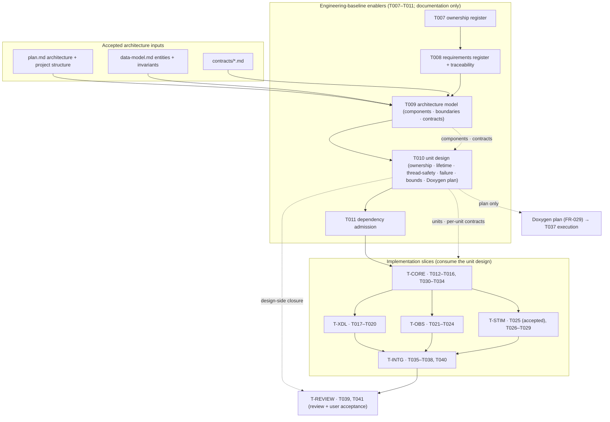

# T010 Architecture — Unit Design, Per-Unit Contracts, and Doxygen Plan

## 1. Document control

| Field | Value |
| --- | --- |
| Task | T010 |
| Stage / role | plan → architecture |
| Revision | 1 |
| Baseline revision | `abb81681e0d844edaecbaf2843f1c2a7deb1e40f` |
| Requirement authority | [`requirements.md`](requirements.md) rev 1 |
| Accepted architecture | `specs/007-xcom-core/plan.md` ("Technical Context", "Architecture", "Project Structure", "Delivery phases", "Complexity Tracking"), `specs/007-xcom-core/data-model.md`, `specs/007-xcom-core/contracts/*.md` |
| Consumed architecture model | `docs/engineering/xcom/t009/architecture-model.{json,md}` (`XCOM-CMP-*`, `XCOM-XB-*`, `XCOM-XLC-*`) |
| Governing ADRs | ADR-0016 (subsystem naming/ownership), ADR-0018 (platform-first), ADR-0019 (X-COM observation/stimulation ownership), ADR-0020 (repository-owned work products and evidence) |
| Consumes | `docs/engineering/xcom/task-ownership.{md,json}` (T007), `docs/engineering/xcom/t008/{requirements-register,traceability-matrix}.{json,md}` (T008), `docs/engineering/xcom/t009/architecture-model.{json,md}` (T009), `Doxyfile`, `scripts/check_doxygen.py`, `specs/007-xcom-core/{spec,plan,data-model,reference-traceability}.md` |
| Maturity | Governance/planning target; no production or runtime claim |

## 2. Position in the accepted architecture

T010 sits in phase 2 (repository-owned engineering baseline) of capability 007, immediately after T009
(architecture model, boundaries, and cross-language contracts) and before T011 (dependency admission). It is a
**unit-design layer** beneath the accepted architecture and above the implementation slices:



**Dependency order.** T005/T006 (accepted) → T007 (ownership register) → T008 (requirement register) → T009
(architecture model) → T010 (this unit design) → T011 (dependency admission) → `T-CORE` → {`T-XDL`,
`T-OBS`, `T-STIM`} → `T-INTG` → `T-REVIEW` → T041. The order preserves the `tasks.md` "Dependencies and
execution order" statement: T007–T011 precede production code; T012–T016 establish the core; T017–T020 bind
it to XDL; observation and stimulation follow the core; the review closes the slice.

T010 refines, and never replaces, the T009 model. T009 answers *what the architectural components, boundaries,
and contracts are*; T010 answers *how each implementing unit owns, lives, synchronizes, fails, is bounded, and
is documented*. A unit that T009 did not sanction as a component/contract cannot be created here.

## 3. Architectural decomposition

### 3.1 Unit families

The unit design groups the accepted components into seven families. Family placement is derived, not invented:
it follows the T009 component layers, the T007 slices, and the accepted plan's project structure.

| Family | Meaning | T009 components it elaborates | Owning slices |
| --- | --- | --- | --- |
| `CORE` | Contract/item/diagnostic/policy value types, endpoint/route lifecycle, provider composition, owned loopback provider | `XCOM-CMP-004`–`007` | `T-CORE` |
| `XDL` | XDL Profile/plan compiler (Python), activation-plan v1 schema, bounded C++ plan decode | `XCOM-CMP-001`–`003` | `T-XDL` |
| `OBS` | Observation record, payload-view policy, bounded observer queue, counters, synthetic sink | `XCOM-CMP-008`, `XCOM-CMP-011` | `T-OBS` |
| `STIM` | Time authority, permit/session lifecycle, journal, fail-closed guard, guarded injection/lease | `XCOM-CMP-009`, `XCOM-CMP-010` | `T-STIM` |
| `GW` | Versioned tool API, local-IPC-only gateway session, separate-process synthetic client | `XCOM-CMP-010`–`012` | `T-CORE` (`T030`–`T034`) |
| `INTG` | Doxygen/documentation unit, traceability validation, public-safe evidence bundle, benchmark evidence | (cross-cutting) | `T-INTG` |
| `ENB` | Enabler requirement register, architecture model, unit-design model, dependency admission, review record | (cross-cutting) | `T-ENABLER`, `T-REVIEW` |

### 3.2 Per-unit contract dimensions

Every unit record carries six mandatory design dimensions, plus the evidence/Doxygen obligations:

1. **Ownership** — the closed ownership model, its rationale, and (for mutating units) the exact issued handle
   that may mutate or close the resource.
2. **Lifetime** — the closed lifetime model that bounds the validity of the unit's state or handle, plus the
   bounded `view_lifetime` when the unit exposes a borrowed or payload view.
3. **Thread-safety** — the closed thread-safety model, the shared mutable state the unit owns or exposes, and
   the synchronization mechanism or message-passing/process boundary that protects it.
4. **Failure semantics** — the classified condition → outcome mapping, the unknown-outcome rule, and the
   evidence-incomplete outcome for journaled or durably written state.
5. **Bounds** — at least one finite resource bound with its kind and configuring source, plus the declared
   overflow/backpressure policy for capacity/quota/depth/rate bounds.
6. **Doxygen obligation** — for C++ units, the group, mandatory file block, mandatory public tags, and the
   declared public/documented element counts; for non-C++ units, `required = false` with a reason.
7. **Traceability** — `requirement_links` (T008), `component_refs`/`contract_refs` (T009), owning
   slice/task (T007), and planned evidence.

### 3.3 Traceability chain

```text
accepted plan / data-model / contracts ──elaborated_by──▶ T009 XCOM-CMP/XB/XLC records
T009 components & contracts  ──designed_by──▶  T010 XCOM-DU-### unit records
T008 XCOM-SW-* software requirements  ──covered_by──▶  unit.requirement_links
unit.artifact_paths (established|planned) ──▶ real or planned product path
unit.ownership/lifetime/thread_safety/failure/bounds ──▶ implementation slices' code & tests
unit.doxygen ──enforced_by──▶ Doxyfile + scripts/check_doxygen.py (T011 admission, T037 execution)
XVE-SYS-0139..0158 ──no promotion──▶ ref002.disposition = "unchanged", promoted = []
```

Every arrow is stored once in the model and is traversable in both directions. No arrow is inferred from
prose, and component/requirement coverage is checked in both directions.

## 4. Artifact decomposition

| Artifact | Path | Stage | Owner | Purpose |
| --- | --- | --- | --- | --- |
| Unit-design plan (5 docs) | `docs/engineering/xcom/t010/{requirements,architecture,detailed-design,unit-specifications,verification-plan}.md` | plan | T010 / `T-ENABLER` | This bounded design package |
| Unit-design model (machine) | `docs/engineering/xcom/t010/unit-design.json` | implementation | T010 / `T-ENABLER` | Canonical unit/ownership/lifetime/thread-safety/failure/bounds/Doxygen model |
| Design-units catalogue (human) | `docs/engineering/xcom/t010/design-units.md` | implementation | T010 / `T-ENABLER` | Deterministic projection of the model; realises the T008 `design_unit` locator `XCOM-DU-INTG-BASELINE` |
| Model validator | `scripts/validate_xcom_unit_design.py` | implementation | T010 / `T-ENABLER` | Offline, deterministic, bounded checks with a self-test |
| Implementation record | `docs/engineering/xcom/t010/implementation.md` | implementation | T010 / `T-ENABLER` | Candidate revision, commands, outcomes, limitations |
| Capability task state | `specs/007-xcom-core/tasks.md` | implementation | shared | Mark T010 complete only in the implementation stage |
| Ownership consistency | `docs/engineering/xcom/task-ownership.{json,md}` | implementation | shared | Record the new validator path in `T-ENABLER` and re-validate |
| Internal review | `docs/engineering/xcom/t010/internal-review.json` | review | T010 / `T-ENABLER` | Separate read-only review verdict and findings |
| Package manifest | `reports/xcom-queue/t010-package.json` | package | workflow | Exact-candidate changed paths and hashes |

The five plan-stage work products are documentation and are produced before implementation. No `src/`,
`tests/`, `xdl/`, or `proto/` path is created or changed, and no `Doxyfile`/CMake/build file is changed.

## 5. Product paths the unit design anchors

These are the real or planned product paths the model records per unit, each tagged `established` or
`planned`. T010 **anchors** them; it does not change them. Paths marked *(planned)* are named by the accepted
plan/tasks and are not yet present in the baseline; the full per-unit table is in `unit-specifications.md`
§4–§10.

| Family | Anchor examples |
| --- | --- |
| `CORE` | `src/xverse/xcom/include/xverse/xcom/{value,contract,item,diagnostic,result,core_types}.hpp` and `src/{value,contract,item,diagnostic}.cpp` (established); `src/xverse/xcom/include/xverse/xcom/endpoint_route_lifecycle.hpp`, `provider.hpp`, `loopback_provider.hpp` (established) |
| `XDL` | `xdl/metamodel/NORMALIZED_MODEL.md`, `xdl/schemas/v1alpha1/`, `src/xverse_xdl/xcom_plan.py`, `xdl/profiles/xcom-v0.1.schema.json`, `src/xverse/xcom/contracts/v1/activation-plan.schema.json`, `src/xverse/xcom/include/xverse/xcom/activation_plan.hpp` *(established paths; acceptance pending)* |
| `OBS` | `src/xverse/xcom/include/xverse/xcom/observation.hpp`, `src/xverse/xcom/src/observation.cpp`, `tests/xcom/observation/` (established) |
| `STIM` | `src/xverse/xcom/include/xverse/xcom/validation_session.hpp`, `src/xverse/xcom/src/validation_session.cpp` (established, bound to the accepted T025 revision); `src/xverse/xcom/include/xverse/xcom/stimulation_journal.hpp` *(planned)* |
| `GW` | `proto/xverse/xcom/v1/tool_gateway.proto`, `src/xverse/xcom/include/xverse/xcom/tool_gateway.hpp`, `src/xverse/xcom/src/tool_gateway.cpp` *(planned)* |
| `INTG` | `Doxyfile`, `scripts/check_doxygen.py`, `scripts/validate_xcom_requirements_traceability.py`, `docs/xcom/`, `tests/xcom/observation/integration/disabled_tap_benchmark.cpp` (established); `docs/engineering/xcom/t035/`..`t040/`, `tests/xcom/performance/` *(planned)* |
| `ENB` | `docs/engineering/xcom/task-ownership.{json,md}` (established), `docs/engineering/xcom/t008/`, `docs/engineering/xcom/t009/` (established), `docs/engineering/xcom/t010/` (established at this revision), `docs/engineering/xcom/dependency-lock.md` (established), `docs/engineering/xcom/t039/` *(planned)* |

Per the T007 per-task artifact rule, each task's `docs/engineering/xcom/<task>/` directory and
`reports/xcom-queue/<task>-package.json` remain reserved to the owning slice; T010 does not claim any other
task's artifacts, and it does not edit the T008 matrix that already declares the `design-units.md` locator.

## 6. Baseline, authorization, and ownership binding

- **Authorized baseline**: T010 binds to `abb81681e0d844edaecbaf2843f1c2a7deb1e40f` (validated by
  `git rev-parse`). No tag, branch, or ambient state is a valid baseline. Every inherited T009 slice baseline
  (`209084b11a211273f815980f753ba728e1251a09`), T008 slice baseline
  (`957a60723f99c3a31efba1cbd137c454c4acb462`), and T007 slice baseline
  (`923a6db65aafbcdbf33a1461e93622777e902deb`) remains a historical predecessor binding and is not
  overwritten.
- **Candidate revision rule**: each candidate records its own exact revision and its accepted predecessor
  revision; acceptance is per candidate and never inherited from a sibling or from source presence.
- **Authorization references**: ACC001–ACC015 (design acceptance, bounded implementation authorization, and the
  ACC015 workflow amendment), ADR-0016, ADR-0018, ADR-0019, and ADR-0020.
- **Safety boundary** (from ACC011/ACC014 and the spec exclusions): no legacy adapter/execution, external
  peer, TCP listener, physical bus, deployment, or compatibility claim.
- **Ownership binding**: T010 belongs to the `T-ENABLER` slice (T007 assignment). Its artifacts are declared
  under `docs/engineering/xcom/t010/` (already exclusive to `T-ENABLER`) and one new script
  `scripts/validate_xcom_unit_design.py`, recorded for `T-ENABLER` in the T007 register.
- **Review/acceptance**: independent read-only review (T039) before explicit user acceptance (T041). T010
  neither performs nor presumes either.

## 7. Build and verification integration

- T010 changes documentation/governance only plus one script under `scripts/`:
  `docs/engineering/xcom/t010/**`, `scripts/validate_xcom_unit_design.py`, an entry in
  `specs/007-xcom-core/tasks.md` (implementation stage), and the T007 ownership-register consistency update.
  It adds no CMake target and no CTest test, and it runs no compiler.
- The model validator is a repository-owned Python 3.11-compatible script under `scripts/` (allowed; not a
  product path). It is an offline static checker, not a C++/runtime test.
- The deterministic gate for T010 is
  `python3 /home/jefferson/x-verse_fabric/automation/xcom_feature_gate.py verify T010 abb8168…`; it requires
  the six work products, the T010 checkbox state, a changed-path set with no `src/`, `tests/`, or `xdl/` path,
  and `git diff --check` (see `verification-plan.md` §2).
- The Doxygen plan is design input to T011/T037, not an executed gate in T010: `Doxyfile` and
  `scripts/check_doxygen.py` are **read** as admitted inputs and are not modified.

**Affected paths and bounds.** The T010 candidate affects only its work products, the unit-design model and
projection, the validator, and the ownership-register consistency update; no `src/`, `tests/`, `xdl/`, or
`proto/` path changes (T010-SR-012). T010 has no runtime concurrency; the validator is offline,
single-threaded, bounded (≤ 1 MiB per file, ≤ 4 MiB total, ≤ 60 s, no network or subprocess), and
deterministic. Negative cases are the design defects NEG-01..NEG-46 in `verification-plan.md` §4.

## 8. Constitution and ADR check

| Check | Assessment |
| --- | --- |
| Production safety | No legacy repository or process is touched; `UDI-13` and the boundary rule prohibit it. Every designed unit runs on owned loopback/synthetic fixtures only. |
| Domain neutrality | Units are protocol- and domain-neutral; `UDI-12` rejects an ECU/CAN/SOME/IP/Zenoh core primitive and the validator enforces it. |
| XDL centrality | `XCOM-DU-009`–`011` keep the activation plan a derived, digest-bound artifact; no competing configuration language is designed. |
| Standards interoperability | The gateway and observation units keep OpenTelemetry/ASAM XIL as later adapters, not replacements. |
| Logical/physical separation | `UDI-02` keeps logical identity independent of provider/address/handle; ownership models are handle-bound. |
| Physical hardware as first-class concern | Provider, time-authority, and lease units carry realization/time/capability limits and explicit failure semantics; hardware execution is deferred, not designed away. |
| Platform before compatibility | `UDI-11` and the dependency-direction rule preserve platform-first ordering; no legacy adapter unit exists. |
| Blueprint isolation | No reverse dependency; blueprint/domain work remains outside capability 007. |
| Explicit fidelity and maturity | Unit maturity distinguishes implemented, partial, allocated, deferred, and unreconciled work; source presence is never acceptance (`UDI` maturity/reconciliation rule). |
| Reproducibility and traceability | Exact baseline/authorization binding, deterministic serialization, offline validation, public-safe content, and full requirement/component/contract trace in §9. |
| Capability acceptance gates | Evidence, review, documentation, failure-semantics, compatibility, and maturity obligations are mapped per unit; no gate is removed or weakened. |
| ADR-0016/0018/0019/0020 | Subsystem naming/ownership, platform-first sequencing, X-COM observation/stimulation ownership, and repository-owned exact-candidate evidence are preserved. |

## 9. Requirement-to-unit trace

| Requirement | Units / artifacts | Planned evidence |
| --- | --- | --- |
| T010-STK-001 | `XCOM-DU-001`–`030`; `U-UNIT`, `U-COVER` | CHK-03, CHK-04, CHK-09, CHK-10 |
| T010-STK-002 | `U-GOV`, `U-SAFE`; governing-ADR records | CHK-11, NEG-31..NEG-34 |
| T010-STK-003 | `U-BIND`, `U-COVER` | CHK-09, CHK-10, CHK-12, CHK-13, NEG-35..NEG-39 |
| T010-STK-004 | `U-THREAD`, `U-BOUND` | CHK-05, CHK-06, NEG-17..NEG-24 |
| T010-STK-005 | `U-FAIL` | CHK-07, NEG-25..NEG-27 |
| T010-STK-006 | `U-DOXY`; `doxygen_plan` | CHK-08, NEG-28..NEG-30 |
| T010-STK-007 | `U-MODEL`, `U-SAFE`, `U-VALIDATE` | CHK-01, CHK-14, CHK-16, DET-01..DET-04 |
| T010-STK-008 | `U-SAFE` | CHK-18; no acceptance claim |
| T010-SR-001 | `U-MODEL` | CHK-01, CHK-02, CHK-16, ORD-01, NEG-01..NEG-05, NEG-40 |
| T010-SR-002 | `U-UNIT` | CHK-03, CHK-11, CHK-15, NEG-06..NEG-09 |
| T010-SR-003 | `U-UNIT` | CHK-04, NEG-12..NEG-16, NEG-20 |
| T010-SR-004 | `U-THREAD` | CHK-05, NEG-10, NEG-17..NEG-20, NEG-18b, NEG-19b |
| T010-SR-005 | `U-BOUND` | CHK-06, NEG-21..NEG-24 |
| T010-SR-006 | `U-FAIL` | CHK-07, NEG-11, NEG-25..NEG-27 |
| T010-SR-007 | `U-DOXY` | CHK-08, NEG-28..NEG-30 |
| T010-SR-008 | `U-COVER` | CHK-09, CHK-10, NEG-44, NEG-46 |
| T010-SR-009 | `U-COVER` | CHK-10, NEG-37, NEG-39, NEG-45, NEG-46 |
| T010-SR-010 | `U-GOV` | CHK-11, NEG-31..NEG-34 |
| T010-SR-011 | `U-BIND` | CHK-12, CHK-13, CHK-15, NEG-35, NEG-36, NEG-38, NEG-42, NEG-43 |
| T010-SR-012 | boundary rule (`U-SAFE`) | CHK-18, BND-01, BND-06, deterministic gate |
| T010-SR-013 | `U-SAFE` | CHK-14, NEG-41 |
| T010-SR-014 | `U-VALIDATE` | CHK-16, CHK-17, CHK-18, `--self-test` |
