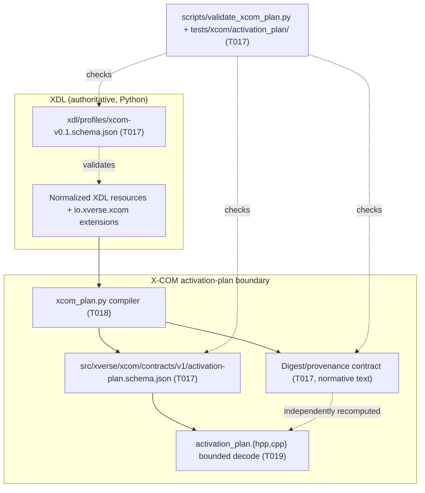

# T017 Architecture — XDL Profile, Activation-Plan, and Digest/Provenance Contracts

## 1. Document control

| Field | Value |
| --- | --- |
| Task | T017 |
| Stage / role | plan → architecture |
| Revision | 1 |
| Baseline revision | `a78d6d55dd5a68b1572cf5a594100dfba3be523e` |
| Requirement authority | [`requirements.md`](requirements.md) rev 1 |
| Accepted architecture | `specs/007-xcom-core/plan.md` ("Technical Context", "Architecture", "Project Structure", "Delivery phases" 4), `specs/007-xcom-core/contracts/{xdl-profile,communication-plan}.md`, `specs/007-xcom-core/data-model.md` |
| Consumed architecture model | `docs/engineering/xcom/t009/architecture-model.{json,md}` (`XCOM-CMP-001`–`003`, `XCOM-XB-001`–`003`, `XCOM-XLC-001`, `XCOM-XLC-005`) |
| Consumed unit design | `docs/engineering/xcom/t010/{requirements,design-units}.md` (`XCOM-DU-009`, `XCOM-DU-010`, `XCOM-DU-011`) |
| Governing ADRs | ADR-0016 (subsystem naming/ownership), ADR-0018 (platform-first), ADR-0020 (repository-owned work products and evidence) |
| Consumes | `docs/engineering/xcom/task-ownership.{md,json}`, `docs/engineering/xcom/t008/{requirements-register,traceability-matrix}.{json,md}`, `docs/engineering/xcom/t009/architecture-model.{json,md}`, `docs/engineering/xcom/t010/design-units.md`, `xdl/schemas/v1alpha1/*.schema.json`, `src/xverse_xdl/schema.py`, `specs/007-xcom-core/{spec,plan,data-model,reference-traceability}.md` |
| Maturity | Definition/validation target; no production or runtime claim |

## 2. Position in the accepted architecture

T017 sits in phase 4 (XDL-derived activation plan) of capability 007, after `T-CORE` (T012–T016) and before
the compiler (T018), the decoder (T019), and the regression suite (T020). It is the **contract-definition
layer** that binds the XDL world to the X-COM C++ world:



**Dependency order.** T007 (ownership) → T008 (requirements) → T009 (architecture) → T010 (unit design) →
T011 (dependency admission) → `T-CORE` → **T017 (Profile/plan/digest contracts)** → T018 (compiler) → T019
(decoder) → T020 (regression tests) → `T-INTG` → `T-REVIEW` → T041. This preserves the `tasks.md`
"Dependencies and execution order" statement that T017–T020 bind the core to XDL.

T017 refines, and never replaces, the T009/T010 model. T009 answers *what the components, boundaries, and
contracts are*; T010 answers *how each implementing unit owns, lives, synchronizes, fails, is bounded, and is
documented*; T017 answers *what exact Profile/plan/digest schemas cross the normalized-XDL → plan → decoder
boundary and how they fail closed*. `T017-U-01` realises `XCOM-DU-009` and `T017-U-02` realises
`XCOM-DU-010`; no new T009 component or contract is created.

## 3. Architectural decomposition

### 3.1 The two schemas and the digest contract

The accepted architecture defines three coupled artifacts at the XDL/X-COM boundary. T017 owns the first two
plus the digest rule; T018/T019 consume them.

| Boundary | Artifact | Owner | Purpose |
| --- | --- | --- | --- |
| `XCOM-XB-001` normalized XDL → Profile compiler | `xdl/profiles/xcom-v0.1.schema.json` | T017 | Validate the namespaced Profile payload attached at existing XDL extension points |
| `XCOM-XB-002` compiler → canonical plan | `src/xverse/xcom/contracts/v1/activation-plan.schema.json` + digest/provenance contract | T017 | Validate the canonical derived plan and bind it to the exact input |
| `XCOM-XB-003` plan → core decoder | (same plan schema; decoder is T019) | T017 defines, T019 uses | Give the C++ decoder an independently checkable version/digest/bound contract |

### 3.2 Layer rules (invariants)

1. **Derived, not authored.** Neither schema defines a competing configuration language: the Profile payload
   decorates existing XDL resources and the activation plan is compiled from an already normalized and
   validated XDL graph (`contracts/communication-plan.md`).
2. **One-way dependency.** XDL/profile and plan artifacts never depend on X-COM runtime types; X-COM runtime
   types never depend on XDL Python internals. The boundary is the JSON schema plus the digest rule.
3. **Logical/physical separation.** The Profile payload is not permitted to carry provider addresses,
   credentials, permits, handles, or sessions; those live in deployment/scenario realization, not logical
   resources (`contracts/xdl-profile.md`, `data-model.md` invariant 1).
4. **Fail closed.** Unknown fields, unsupported versions, undeclared discriminators, duplicate identifiers,
   out-of-order collections, and unresolved inputs are rejected (or excluded from activation) rather than
   defaulted.
5. **Digest-bound.** Every activation decision is bound to the exact plan digest (`data-model.md` invariant
   7); the digest is domain-separated and recomputable independently by T019.
6. **Bounded.** Every schema is a finite static artifact; every validator input is size-, depth-, and
   node-bounded; no plan value is unbounded.
7. **Domain neutral.** No member of either schema names an ECU, CAN, SOME/IP, Zenoh, or product-specific
   primitive; domain semantics arrive through providers/profiles/adapters.

### 3.3 Profile attachment model

The XDL v1alpha1 `extensions` object is keyed by namespace and validated by `common.schema.json`
(`propertyNames: namespace`). The `io.xverse.xcom` Profile v0.1 payload is the value at the
`extensions["io.xverse.xcom"]` member of a legal XDL resource location, and is additionally selectable by a
Profile resource `spec.schemaRef` pointing at `xcom-v0.1.schema.json`.
`xdl/profiles/runtime-compatibility-v0.1.schema.json` is the existing precedent for a namespaced, closed,
Draft 2020-12 profile schema; T017 follows the same conventions (`$schema`, absolute `$id`, closed objects,
`$defs`).

### 3.4 Traceability chain

```text
FR-031 / FR-002 / SC-002 ──refined_by──▶ XCOM-SYS-FR-031 / FR-002 / SC-002
XCOM-SW-XDL-001 ──allocated_to──▶ XCOM-DU-XDL-BASELINE ──realised_by──▶ T017-U-01 · T017-U-02
XCOM-SW-XDL-001 ──verified_by──▶ XCOM-T-XDL ──realised_by──▶ tests/xcom/activation_plan/
contracts/{xdl-profile,communication-plan}.md ──elaborated_by──▶ T017-U-01..U-07 records
T017-U-0x artifacts ──consumed_by──▶ T018 (compile) · T019 (decode) · T020 (regress)
XVE-SYS-0139..0158 ──no promotion──▶ ref002.disposition = "unchanged", promoted = []
```

## 4. Artifact decomposition

| Artifact | Path | Stage | Owner | Purpose |
| --- | --- | --- | --- | --- |
| Plan work products (5 docs) | `docs/engineering/xcom/t017/{requirements,architecture,detailed-design,unit-specifications,verification-plan}.md` | plan | T017 / `T-XDL` | This bounded design package |
| Profile v0.1 schema | `xdl/profiles/xcom-v0.1.schema.json` | implementation | T017 / `T-XDL` | Closed `io.xverse.xcom` payload schema (realises `XCOM-DU-009`) |
| Activation-plan v1 schema | `src/xverse/xcom/contracts/v1/activation-plan.schema.json` | implementation | T017 / `T-XDL` | Closed canonical plan schema (realises `XCOM-DU-010`) |
| Profile/digest contract | `specs/007-xcom-core/contracts/xdl-profile.md` | implementation | T017 / `T-XDL` | Additive normative grammar + digest/provenance contract |
| Plan validator | `scripts/validate_xcom_plan.py` | implementation | T017 / `T-XDL` | Offline, deterministic, bounded checker with self-test |
| Validation tests | `tests/xcom/activation_plan/{test_profile_schema,test_activation_plan_schema,test_digest_contract}.py` | implementation | T017 / `T-XDL` | Pytest validation of Profile/plan/digest |
| Bounded fixtures | `tests/xcom/activation_plan/fixtures/` | implementation | T017 / `T-XDL` | Positive and negative Profile/plan/digest vectors |
| Implementation record | `docs/engineering/xcom/t017/implementation.md` | implementation | T017 / `T-XDL` | Candidate revision, commands, outcomes, limitations |
| Capability task state | `specs/007-xcom-core/tasks.md` | implementation | shared | Mark T017 complete only in the implementation stage |
| Internal review | `docs/engineering/xcom/t017/internal-review.json` | review | T017 / `T-XDL` | Separate read-only review verdict and findings |
| Package manifest | `reports/xcom-queue/t017-package.json` | package | workflow | Exact-candidate changed paths and hashes |

## 5. Product paths T017 anchors or creates

T017 **creates** `xdl/profiles/xcom-v0.1.schema.json`, `src/xverse/xcom/contracts/v1/activation-plan.schema.json`,
`scripts/validate_xcom_plan.py`, and `tests/xcom/activation_plan/**`; it **extends** the already-present
`specs/007-xcom-core/contracts/xdl-profile.md`. T017 **anchors but never changes** the successor paths
`src/xverse_xdl/xcom_plan.py` (T018) and
`src/xverse/xcom/include/xverse/xcom/activation_plan.hpp` + `src/xverse/xcom/src/activation_plan.cpp`
(T019). Per the T007 per-task artifact rule, `docs/engineering/xcom/t017/` and
`reports/xcom-queue/t017-package.json` remain reserved to T017.

## 6. Baseline, authorization, and ownership binding

- **Authorized baseline**: `a78d6d55dd5a68b1572cf5a594100dfba3be523e`, validated by `git rev-parse`. No tag,
  branch, or ambient state is a valid binding. Each predecessor slice baseline
  (`923a6db`/`957a607`/`209084b`/`abb8168`/`a78d6d5`) remains a historical predecessor binding.
- **Candidate revision rule**: each candidate records its own exact revision and its accepted predecessor
  revision; acceptance is per candidate and never inherited from a sibling or from source presence.
- **Authorization references**: ACC002, ACC003, ACC013, ACC014, ACC015; ADR-0016, ADR-0018, ADR-0020.
- **Safety boundary** (from ACC011/ACC014 and the spec exclusions): no legacy adapter/execution, external
  peer, TCP listener, physical bus, deployment, or compatibility claim.
- **Ownership binding**: T017 belongs to the `T-XDL` slice (T007 assignment). Its paths are all declared in
  the `T-XDL` exclusive list, so no ownership-register edit is required for T017.
- **Review/acceptance**: independent read-only review (T039) before explicit user acceptance (T041). T017
  neither performs nor presumes either.

## 7. Build and verification integration

- T017 adds no CMake target and no CTest test; it changes JSON schemas, one T-XDL-owned contract document,
  one Python validator script, and Python/pytest tests, and (implementation stage) the T017 checkbox.
- The validator is a repository-owned Python 3.11-compatible `scripts/` tool, consistent with
  `src/xverse_xdl/schema.py`'s Draft 2020-12 approach (`jsonschema` `Draft202012Validator` + `registry`). It
  is an offline static checker, not a runtime test.
- The deterministic gate for T017 is
  `python3 /home/jefferson/x-verse_fabric/automation/xcom_feature_gate.py verify T017 a78d6d55…`; it requires
  the six work products, the T017 checkbox marked, a change under `specs/007-xcom-core/contracts/` or `xdl/`,
  a change under `tests/`, `git diff --check` clean, and a passing full `pytest` run
  (`verification-plan.md` §2).
- The digest/provenance contract is design input to T018 (compiler) and T019 (independent decoder); T017
  provides the executable reference check in the validator, not the compiler.

**Affected paths and bounds.** The T017 candidate affects only §4's paths. No `src/xverse/xcom/include/**`,
`src/xverse/xcom/src/**`, `src/xverse_xdl/**`, `proto/**`, CMake, or `Doxyfile` path changes. The schemas have
no runtime concurrency; the validator is offline, single-threaded, bounded (≤ 5 MiB per supplied document,
≤ 16 MiB aggregate, depth ≤ 100, nodes ≤ 100 000, ≤ 60 s, no network/subprocess/write), and deterministic.
Negative cases are `NEG-P01`..`NEG-G05` in `verification-plan.md` §4.

## 8. Constitution and ADR check

| Check | Assessment |
| --- | --- |
| Production safety | No legacy repository or process is touched; the Profile/plan schemas carry no address/credential and no execution path is defined. |
| Domain neutrality | T017-U-01/02 are protocol- and domain-neutral; the validator rejects a domain primitive in either schema. |
| XDL centrality | The Profile decorates existing XDL extension points and the plan is derived and digest-bound; no competing configuration language is defined. |
| Standards interoperability | Canonical serialization stays a small explicit rule; RFC 8785/JCS-style interoperability is a documented later option, not a replacement. |
| Logical/physical separation | T017-SR-003 forbids addresses/credentials/permits/handles/sessions in the logical Profile payload. |
| Physical hardware as first-class concern | The plan records provider capabilities and declared fidelity/limitations, and leaves hardware execution deferred rather than modelled away. |
| Platform before compatibility | Dependency order preserves platform-first sequencing; no legacy adapter path is defined. |
| Blueprint isolation | No reverse dependency; blueprint/domain work remains outside capability 007. |
| Explicit fidelity and maturity | Maturity is `allocated` for T018/T019/T020 and the T017 artifacts are definition-only; source presence is never acceptance. |
| Reproducibility and traceability | Exact baseline/authorization binding, canonical serialization, offline validation, public-safe content, and full requirement/design linkage in §9. |
| Capability acceptance gates | Evidence, review, documentation, failure-semantics, compatibility, and maturity obligations are mapped per unit; no gate is removed or weakened. |
| ADR-0016/0018/0020 | Subsystem naming/ownership, platform-first sequencing, and repository-owned exact-candidate evidence are preserved. |

## 9. Requirement-to-unit trace

| Requirement | Units / artifacts | Planned evidence |
| --- | --- | --- |
| T017-STK-001 | T017-U-01, T017-U-03, T017-U-04 | CHK-01..CHK-04, NEG-P01..P14 |
| T017-STK-002 | T017-U-02, T017-U-03 | CHK-05..CHK-08, NEG-A01..A22 |
| T017-STK-003 | T017-U-02, T017-U-03, T017-U-05 | CHK-09, CHK-10, DET-01..DET-03, NEG-A14..A16, NEG-D01..D04 |
| T017-STK-004 | T017-U-05, T017-U-06, T017-U-07 | CHK-11..CHK-13, BND-01..BND-04, NEG-V01..V08 |
| T017-STK-005 | T017-U-04, T017-U-08 | CHK-14..CHK-16, NEG-G01..G05 |
| T017-SR-001 | T017-U-01 | CHK-01, CHK-02; NEG-P01..P05 |
| T017-SR-002 | T017-U-01 | CHK-03; NEG-P06..P11 |
| T017-SR-003 | T017-U-01, T017-U-04 | CHK-04; NEG-P12..P14 |
| T017-SR-004 | T017-U-02 | CHK-05, CHK-06; NEG-A01..A08 |
| T017-SR-005 | T017-U-02, T017-U-05 | CHK-07; NEG-A09, NEG-A10 |
| T017-SR-006 | T017-U-02, T017-U-05 | CHK-08; NEG-A11..A13, NEG-A17..A22 |
| T017-SR-007 | T017-U-02, T017-U-03, T017-U-05 | CHK-09, CHK-10, DET-01..DET-03; NEG-A14..A16, NEG-D01..D04 |
| T017-SR-008 | T017-U-05 | CHK-11, CHK-12, BND-01..BND-04; NEG-V01..V08 |
| T017-SR-009 | T017-U-06, T017-U-07 | CHK-13; `pytest` gate |
| T017-SR-010 | T017-U-04 | CHK-14 |
| T017-SR-011 | T017-U-04, T017-U-08 | CHK-15, CHK-16; NEG-G01..G05 |
