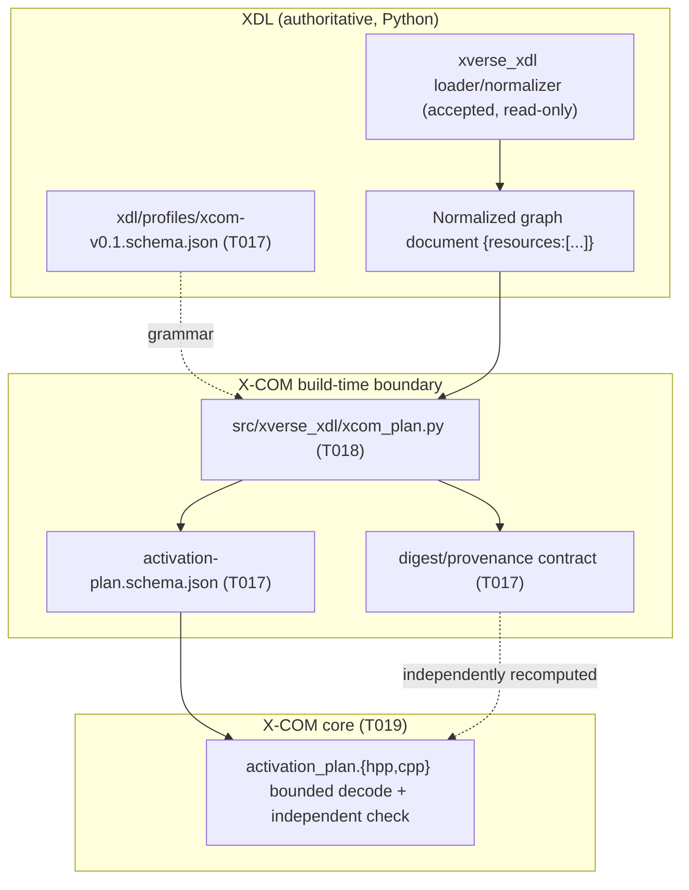
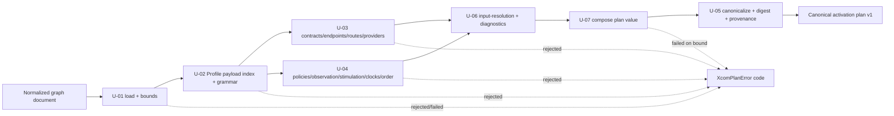

# T018 Architecture — Deterministic Profile-Aware Plan Compiler

## 1. Document control

| Field | Value |
| --- | --- |
| Task | T018 |
| Stage / role | plan → architecture |
| Revision | 1 |
| Baseline revision | `56506d2c9cb71791cba06a1cc418fcadee72e0fa` |
| Requirement authority | [`requirements.md`](requirements.md) rev 1 |
| Accepted architecture | `specs/007-xcom-core/plan.md` ("Technical Context", "Architecture", "Project Structure", "Delivery phases" 4), `specs/007-xcom-core/contracts/{xdl-profile,communication-plan}.md`, `specs/007-xcom-core/data-model.md` |
| Consumed architecture model | `docs/engineering/xcom/t009/architecture-model.{json,md}` (`XCOM-CMP-001`–`003`, `XCOM-XB-001`/`002`, `XCOM-XLC-001`, `XCOM-XLC-005`) |
| Consumed unit design | `docs/engineering/xcom/t010/{requirements,design-units}.md` (`XCOM-DU-009`) |
| Consumed contract artifacts | `docs/engineering/xcom/t017/{architecture,detailed-design,unit-specifications,verification-plan}.md`, `xdl/profiles/xcom-v0.1.schema.json`, `src/xverse/xcom/contracts/v1/activation-plan.schema.json`, `scripts/validate_xcom_plan.py`, `specs/007-xcom-core/contracts/xdl-profile.md` |
| Governining ADRs | ADR-0016 (subsystem naming/ownership), ADR-0018 (platform-first), ADR-0020 (repository-owned work products and evidence) |
| Consumes | `docs/engineering/xcom/task-ownership.{md,json}`, `docs/engineering/xcom/t008/{requirements-register,traceability-matrix}.{json,md}`, `src/xverse_xdl/{models,normalize,validate}.py`, `xdl/schemas/v1alpha1/*.schema.json`, `xdl/examples/v1alpha1/*` |
| Maturity | Implementation target for the build-time compiler; no runtime or production claim |

## 2. Position in the accepted architecture

T018 sits in phase 4 (XDL-derived activation plan) of capability 007, immediately after T017 and before the
decoder (T019) and the regression suite (T020). T017 **defines** the Profile v0.1 grammar, the activation-plan
v1 schema, and the digest/provenance contract; T018 is the **producer** that compiles a plan satisfying them;
T019 **independently decodes and re-checks** it.



**Dependency order.** T007 (ownership) → T008 (requirements) → T009 (architecture) → T010 (unit design) →
T011 (dependency admission) → `T-CORE` → T017 (Profile/plan/digest contracts) → **T018 (compiler)** → T019
(decoder) → T020 (regression tests) → `T-INTG` → `T-REVIEW` → T041. This preserves the `tasks.md`
"Dependencies and execution order" statement that T017–T020 bind the core to XDL.

T018 refines, and never replaces, the accepted architecture. T009 answers *what the components, boundaries,
and contracts are*; T010 answers *how each implementing unit owns, lives, synchronizes, fails, is bounded, and
is documented*; T017 answers *what exact schemas and digest rule cross the boundary*; T018 answers *how the
normalized XDL graph plus the Profile payloads are deterministically compiled into that plan*.
`T018-U-01`..`T018-U-08` realise `XCOM-DU-009`; no new T009 component or contract is created and no accepted
`XCOM-DU-###` is renamed.

## 3. Architectural decomposition

### 3.1 The compiler boundary

| Boundary | Artifact | Owner | Purpose |
| --- | --- | --- | --- |
| `XCOM-XB-001` normalized XDL → compiler | Normalized graph document (from `xverse_xdl.canonical_json`) + `xdl/profiles/xcom-v0.1.schema.json` | T017 defines grammar, T018 consumes | Give the compiler a derived, immutable, already-validated input |
| `XCOM-XB-002` compiler → canonical plan | `src/xverse_xdl/xcom_plan.py` emitting `activation-plan.schema.json` + digest | T018 | Produce the deterministic, digest-bound plan |
| `XCOM-XB-003` plan → core decoder | (decoder is T019) | T017 defines, T019 consumes | Give the C++ decoder an independently checkable plan |

### 3.2 Layer rules (invariants)

1. **Derived, not authored.** The compiler defines no configuration language: its input is the normalized
   graph document produced by the accepted loader/normalizer plus the closed Profile payloads, and its output
   is the already-defined plan schema (`contracts/communication-plan.md`).
2. **One-way dependency.** The compiler depends only on `xverse_xdl`'s normalized models and the Python
   standard library; XDL/profile/plan artifacts never depend on X-COM runtime C++ types and the compiler
   imports no X-COM runtime type (§T018-SR-010, `XCOM-XB-002`).
3. **Logical/physical separation.** Only declared logical graph data feeds the plan; provider addresses,
   credentials, permits, live handles, and sessions are rejected as unknown members (T018-SR-002,
   `contracts/xdl-profile.md`, `data-model.md` invariant 1).
4. **Fail closed.** An unknown field, an unknown discriminator, an unsupported version, a duplicate identity,
   an out-of-order collection, a contradictory derivation, or an unresolved input is rejected or excluded from
   activation rather than defaulted or guessed.
5. **Digest-bound.** The emitted plan carries the T017 domain-separated SHA-256 digest over its canonical body
   (`data-model.md` invariant 7); the compiler never recomputes over itself.
6. **Deterministic.** All collections are sorted by their declared key with unique ids, all diagnostics are
   ordered by `(code, targetId)`, generation time is explicit or the fixed sentinel, and no ambient state,
   clock, filesystem, network, or dict-order dependence can affect the bytes (SC-002).
7. **Bounded.** Every input is size-, depth-, node-, and resource-bounded and every compiled collection has a
   finite declared cap; overflow is `fail-closed`.
8. **Domain neutral.** No member or constant names an ECU, CAN, SOME/IP, Zenoh, or product-specific primitive;
   domain semantics arrive through providers/profiles/adapters.

### 3.3 Compilation pipeline



The pipeline is a pure function from the bounded graph view and the profile index to a plan value; the only
non-deterministic input, `generatedAt`, is an explicit argument with a fixed sentinel default.

### 3.4 Traceability chain

```text
FR-002 / FR-031 / SC-002 ──refined_by──▶ XCOM-SYS-FR-002 / FR-031 / SC-002
XCOM-SW-XDL-002 ──allocated_to──▶ XCOM-DU-XDL-BASELINE ──realised_by──▶ T018-U-01..U-08
XCOM-SW-XDL-002 ──verified_by──▶ XCOM-T-XDL ──realised_by──▶ tests/test_xcom_plan.py
contracts/{xdl-profile,communication-plan}.md ──elaborated_by──▶ T018-U-01..U-08 records
T017 schemas/digest ──consumed_by──▶ T018 (compile) · T019 (decode) · T020 (regress)
XVE-SYS-0139..0158 ──no promotion──▶ ref002.disposition = "unchanged", promoted = []
```

## 4. Artifact decomposition

| Artifact | Path | Stage | Owner | Purpose |
| --- | --- | --- | --- | --- |
| Plan work products (5 docs) | `docs/engineering/xcom/t018/{requirements,architecture,detailed-design,unit-specifications,verification-plan}.md` | plan | T018 / `T-XDL` | This bounded design package |
| Compiler module | `src/xverse_xdl/xcom_plan.py` | implementation | T018 / `T-XDL` | Deterministic Profile-aware plan compilation |
| Compiler tests | `tests/test_xcom_plan.py` | implementation | T018 / `T-XDL` | Compiler unit/contract/determinism/bound/negative tests (inline bounded graph inputs) |
| Implementation record | `docs/engineering/xcom/t018/implementation.md` | implementation | T018 / `T-XDL` | Candidate revision, commands, outcomes, limitations |
| Capability task state | `specs/007-xcom-core/tasks.md` | implementation | shared | Mark T018 complete only in the implementation stage |
| Internal review | `docs/engineering/xcom/t018/internal-review.json` | review | T018 / `T-XDL` | Separate read-only review verdict and findings |
| Package manifest | `reports/xcom-queue/t018-package.json` | package | workflow | Exact-candidate changed paths and hashes |

## 5. Product paths T018 creates and anchors

T018 **creates** `src/xverse_xdl/xcom_plan.py` and `tests/test_xcom_plan.py`. It **anchors but never changes**
the T017 artifacts
`xdl/profiles/xcom-v0.1.schema.json`, `src/xverse/xcom/contracts/v1/activation-plan.schema.json`,
`scripts/validate_xcom_plan.py`, `tests/xcom/activation_plan/**`, and
`specs/007-xcom-core/contracts/xdl-profile.md`; it **anchors but never changes** the T019 paths
`src/xverse/xcom/include/xverse/xcom/activation_plan.hpp` and `src/xverse/xcom/src/activation_plan.cpp`. Per
the T007 per-task artifact rule, `docs/engineering/xcom/t018/` and `reports/xcom-queue/t018-package.json`
remain reserved to T018.

`src/xverse_xdl/__init__.py` is **not** changed: the slice's exclusive list names the exact file
`src/xverse_xdl/xcom_plan.py`, so the compiler is imported as `xverse_xdl.xcom_plan` and re-exports nothing
from the package root. The compiler imports only sibling modules (`from .models import ...`) and the standard
library at import time.

## 6. Baseline, authorization, and ownership binding

- **Authorized baseline**: `56506d2c9cb71791cba06a1cc418fcadee72e0fa`, validated by `git rev-parse`. No tag,
  branch, or ambient state is a valid binding. The T017 predecessor slice baseline (`a78d6d5`) remains a
  historical predecessor binding.
- **Candidate revision rule**: each candidate records its own exact revision and its accepted predecessor
  revision; acceptance is per candidate and never inherited from a sibling or from source presence.
- **Authorization references**: ACC002, ACC003, ACC013, ACC014, ACC015; ADR-0016, ADR-0018, ADR-0020.
- **Safety boundary** (from ACC011/ACC014 and the spec exclusions): no legacy adapter/execution, external
  peer, TCP listener, physical bus, deployment, or compatibility claim.
- **Ownership binding**: T018 belongs to the `T-XDL` slice (T007 assignment). Its paths are all declared in the
  `T-XDL` exclusive list (`src/xverse_xdl/xcom_plan.py`, `tests/test_xcom_plan.py`,
  `docs/engineering/xcom/t018/`, `reports/xcom-queue/t018-package.json`, and the shared
  `specs/007-xcom-core/tasks.md`), so no ownership-register edit is required for T018.
- **Review/acceptance**: independent read-only review (T039) before explicit user acceptance (T041). T018
  neither performs nor presumes either.

## 7. Build and verification integration

- T018 adds no CMake target and no CTest test; it changes one Python `src/xverse_xdl/` module, one Python
  pytest module under `tests/`, and (implementation stage) the T018 checkbox. The compiler is a pure,
  offline, read-only function library; it has no CLI and no entry-point script, so no new CLI surface is
  added.
- The compiler imports `json`, `hashlib`, `re` (or equivalent pure helpers), `dataclasses`, and
  `collections.abc` from the standard library, plus `xverse_xdl` sibling models; it imports no third-party
  module at import time. `jsonschema`/`referencing` are used only by the T017 validator that the tests load
  for cross-checking, not by the compiler.
- The deterministic gate for T018 is
  `python3 /home/jefferson/x-verse_fabric/automation/xcom_feature_gate.py verify T018 56506d2…`; it requires
  the six work products, the T018 checkbox marked, `src/xverse_xdl/xcom_plan.py` in the changed set, at least
  one changed path under `tests/`, `git diff --check` clean, and a passing full `pytest` run.
- T017's `run_checks`/`--check-human` are bound to the exact T017 fixture directories (`fixtures/profile/valid`,
  `fixtures/plan/valid`) and the committed `expected-summary.txt`; T018 adds **no** fixture under those
  directories and uses inline bounded graph inputs in `tests/test_xcom_plan.py`, so the T017 expectation and
  the T017 suite are unchanged.

**Affected paths and bounds.** The T018 candidate affects only §4's paths. The compiled-entity caps and input
bounds are finite and declared in [`unit-specifications.md`](unit-specifications.md) §3.1; overflow policy is
`fail-closed`. Negative cases are `NEG-C01`..`NEG-G05` in
[`verification-plan.md`](verification-plan.md) §4.

## 8. Constitution and ADR check

| Check | Assessment |
| --- | --- |
| Production safety | No legacy repository or process is touched; the compiler reads only in-memory graph data and emits a plan value; no address/credential/execution path is defined. |
| Domain neutrality | Every derivation reads declared logical graph members only; region names are generic and cross-checked by a test against the T017 grammar. |
| XDL centrality | The input is the accepted normalized XDL graph and the namespaced Profile; the plan is derived and digest-bound; no competing configuration language is defined. |
| Standards interoperability | The compiler reproduces the small explicit canonicalization/digest rule; RFC 8785/JCS-style interoperability remains a documented later option (T017 A-8). |
| Logical/physical separation | T018-SR-002 rejects addresses/credentials/permits/handles/sessions in the logical Profile payload. |
| Physical hardware as first-class concern | The plan records provider capabilities and declared fidelity/limitations; T018 leaves hardware realization to the deployment data and claims no fidelity. |
| Platform before compatibility | Dependency order preserves platform-first sequencing; no legacy adapter path is defined. |
| Blueprint isolation | No reverse dependency; the compiler consumes platform XDL only and defines no blueprint/domain artifact. |
| Explicit fidelity and maturity | Maturity is `allocated` for the compiler's runtime behavior and the plan remains a prototype build-time artifact; source presence is never acceptance. |
| Reproducibility and traceability | Exact baseline/authorization binding, canonical byte-stability, offline purity, public-safe content, and full requirement/design linkage in §9. |
| Capability acceptance gates | Evidence, review, documentation, failure-semantics, compatibility, and maturity obligations are mapped per unit; no gate is removed or weakened. |
| ADR-0016/0018/0020 | Subsystem naming/ownership (`xverse_xdl` build-time, X-COM core C++ untouched), platform-first sequencing, and repository-owned exact-candidate evidence are preserved. |

## 9. Requirement-to-unit trace

| Requirement | Units / artifacts | Planned evidence |
| --- | --- | --- |
| T018-STK-001 | T018-U-01, T018-U-03, T018-U-04, T018-U-07 | CHK-01..CHK-04, DET-01, DET-02; NEG-C01..NEG-C08, NEG-C23, NEG-C25 |
| T018-STK-002 | T018-U-02, T018-U-03, T018-U-04 | CHK-02..CHK-04; NEG-C09..NEG-C17 |
| T018-STK-003 | T018-U-05, T018-U-07 | CHK-03, DET-01, DET-02; NEG-C01, NEG-C26 |
| T018-STK-004 | T018-U-06, T018-U-07, T018-U-08 | CHK-05, CHK-07; NEG-C16..NEG-C22, NEG-C24 |
| T018-STK-005 | T018-U-09 | CHK-09; NEG-G01..G05 |
| T018-SR-001 | T018-U-01 | CHK-01, CHK-07; NEG-C01..NEG-C04, NEG-C21..NEG-C23, NEG-C25 |
| T018-SR-002 | T018-U-02 | CHK-02, CHK-06; NEG-C09..NEG-C13 |
| T018-SR-003 | T018-U-03 | CHK-03, CHK-04; NEG-C05..NEG-C08, NEG-C16, NEG-C17 |
| T018-SR-004 | T018-U-04 | CHK-04; NEG-C14, NEG-C15, NEG-C18, NEG-C20, NEG-C24 |
| T018-SR-005 | T018-U-05 | CHK-03, DET-01, DET-02; NEG-C23 |
| T018-SR-006 | T018-U-05 | CHK-03; NEG-C01, NEG-C26 |
| T018-SR-007 | T018-U-06, T018-U-07 | CHK-05; NEG-C16..NEG-C20 |
| T018-SR-008 | T018-U-08 | CHK-07; NEG-C21, NEG-C22 |
| T018-SR-009 | T018-U-10 | CHK-01..CHK-08; `pytest` gate |
| T018-SR-010 | T018-U-09 | CHK-09; NEG-G01..G05 |
