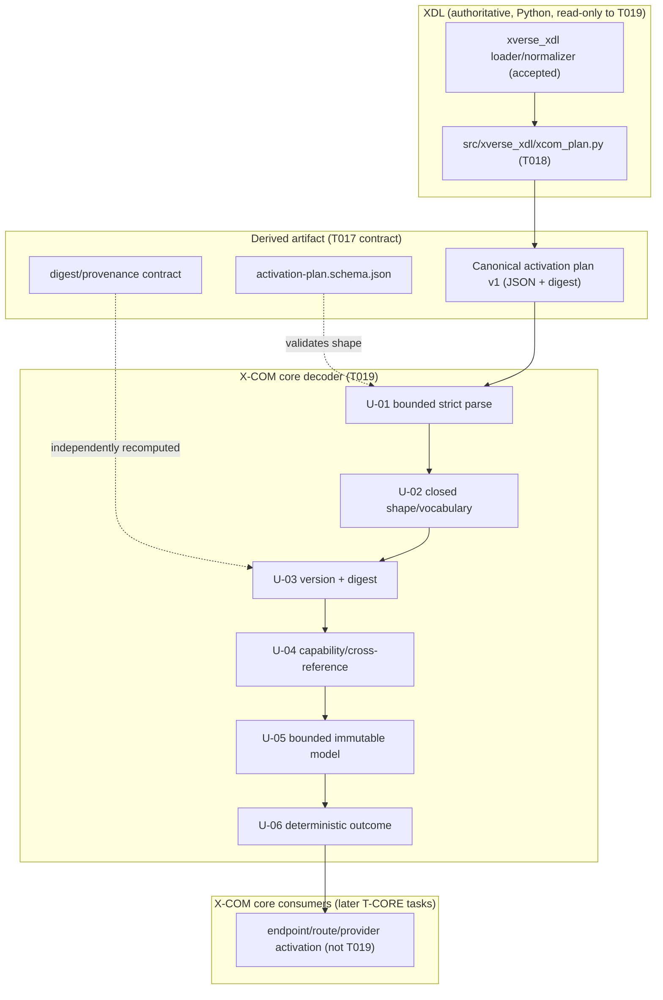
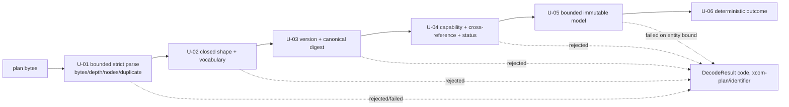

# T019 Architecture — Bounded C++ Activation-Plan Decode

## 1. Document control

| Field | Value |
| --- | --- |
| Task | T019 |
| Stage / role | plan → architecture |
| Revision | 1 |
| Baseline revision | `199de0baa1f50e1d429527b6d6525a6e5d8cf7cf` |
| Requirement authority | [`requirements.md`](requirements.md) rev 1 |
| Accepted architecture | `specs/007-xcom-core/plan.md` ("Technical Context", "Architecture", "Project Structure", "Delivery phases" 4, "Complexity Tracking"), `specs/007-xcom-core/contracts/{xdl-profile,communication-plan}.md`, `specs/007-xcom-core/data-model.md` |
| Consumed architecture model | `docs/engineering/xcom/t009/architecture-model.{json,md}` (`XCOM-CMP-003`, `XCOM-CMP-004`, `XCOM-XLC-001`, `XCOM-XLC-005`, `XCOM-XB-003`) |
| Consumed unit design | `docs/engineering/xcom/t010/{requirements,design-units}.md` (`XCOM-DU-011`) |
| Consumed contract artifacts | `docs/engineering/xcom/t017/{architecture,detailed-design,unit-specifications,verification-plan}.md`, `src/xverse/xcom/contracts/v1/activation-plan.schema.json`, `scripts/validate_xcom_plan.py`, `specs/007-xcom-core/contracts/xdl-profile.md` |
| Consumed producer artifact | `src/xverse_xdl/xcom_plan.py` (T018; anchored, unchanged) |
| Governing ADRs | ADR-0016 (subsystem naming/ownership), ADR-0018 (platform-first), ADR-0020 (repository-owned work products and evidence) |
| Consumes | `docs/engineering/xcom/task-ownership.{md,json}`, `docs/engineering/xcom/t008/{requirements-register,traceability-matrix}.{json,md}`, `docs/engineering/xcom/{build-environment,dependency-lock}.md`, `docs/engineering/xcom/t025/test-dependency-admission.md`, `cmake/XComOfflineDependencies.cmake`, `cmake/XComWarnings.cmake` |
| Maturity | Implementation target for the C++ decoder; no activation, runtime, or production claim |

## 2. Position in the accepted architecture

T019 sits in phase 4 (XDL-derived activation plan) of capability 007, immediately after the T018 compiler and
before the T020 suite. T017 **defines** the activation-plan v1 schema and the digest/provenance contract; T018
**produces** a conforming canonical plan; T019 **independently decodes and re-checks** it before any endpoint,
route, or provider may be activated. T019 is the C++ side of the accepted cross-language boundary
`XCOM-XB-003` (activation plan → core decoder) carrying contract `XCOM-XLC-001`.



**Dependency order.** T007 (ownership) → T008 (requirements) → T009 (architecture) → T010 (unit design) →
T011 (dependency admission) → `T-CORE` → T017 (Profile/plan/digest contracts) → T018 (compiler) →
**T019 (decoder)** → T020 (regression tests) → `T-INTG` → `T-REVIEW` → T041. This preserves the `tasks.md`
"Dependencies and execution order" statement that T017–T020 bind the core to XDL, and the requirement that
T019 implement neither T018 nor T020.

T019 refines, and never replaces, the accepted architecture. T009 answers *what the components, boundaries,
and contracts are*; T010 answers *how each implementing unit owns, lives, synchronizes, fails, is bounded, and
is documented*; T017 answers *what exact schema and digest rule cross the boundary*; T018 answers *how the
plan is compiled*; T019 answers *how the plan is decoded and independently verified before activation*.
`T019-U-01`..`T019-U-06` realise `XCOM-DU-011`; `T019-U-07`/`T019-U-08` are the work-product and test units.
No new T009 component or contract is created and no accepted `XCOM-DU-###` is renamed.

## 3. Architectural decomposition

### 3.1 The decoder boundary

| Boundary | Artifact | Owner | Purpose |
| --- | --- | --- | --- |
| `XCOM-XB-003` plan → core decoder | Canonical plan bytes + `activation-plan.schema.json` + digest rule | T017 defines, T019 consumes | Give the C++ core an independently checkable, non-authoritative derived artifact |
| `XCOM-XLC-001` cross-language schema | `src/xverse/xcom/contracts/v1/activation-plan.schema.json` | T017 defines, T019 consumes | The single interface (member names, vocabularies, canonicalization, digest) between Python and C++ |
| decoder → core consumers | Immutable decoded plan value | T019 produces, later `T-CORE` tasks consume | Fail-closed plan hand-off that binds every later activation decision to the exact plan digest (`data-model.md` invariant 7) |

### 3.2 Layer rules (invariants)

1. **Derived, not authored.** The decoder consumes only the derived canonical plan; it defines no
   configuration language, reads no authored XDL, and re-parses nothing else. The plan schema is the
   canonical artifact (`contracts/communication-plan.md`).
2. **One-way dependency.** The decoder depends only on the C++20 standard library and the already-admitted
   `nlohmann/json` 3.10.5 header. It imports no Python module, no X-COM runtime unit, no legacy artifact, and
   adds no admitted dependency (`XCOM-XLC-001` evolution rule; T019-SR-008).
3. **Logical/physical separation.** The decoder materializes logical identities and declared policy only; a
   provider address, credential, permit, live handle, or session is an unknown member and is rejected
   (`data-model.md` invariant 1).
4. **Fail closed.** An unknown field, a vocabulary/pattern violation, a duplicate member, an out-of-order
   collection, a version/digest mismatch, or an unresolved capability/reference/status is rejected; an
   over-bound or unknown-step outcome is failed; neither returns a decoded value.
5. **Digest-bound and independent.** The decoder recomputes the T017 domain-separated SHA-256 over the digested
   region and never trusts the recorded digest; the digest is never computed over itself. SHA-256 is
   implemented in-tree so the check is genuinely independent of the compiler's Python `hashlib`.
6. **Deterministic.** Canonical bytes are member-name-ordered, whitespace-free, and integral-number-normalized;
   collection order and uniqueness are enforced by the declared keys; the same input yields the same outcome,
   code, and decoded value across repetitions and equivalent representations (SC-002).
7. **Bounded.** Every received byte, nesting level, node, string, and decoded entity is bounded by a finite
   declared cap; overflow is `fail-closed`; no allocation is unbounded and no I/O is performed.
8. **Domain neutral.** No member, code, or constant names an ECU, CAN, SOME/IP, Zenoh, or product-specific
   primitive; domain semantics arrive through the plan/provider/profile boundary.
9. **Immutable value.** The decoded plan is immutable after decode, owned by the caller, and shareable
   read-only without synchronization (`XCOM-DU-011` `immutable-value`); the decoder retains no global state.

### 3.3 Decode pipeline



The pipeline is a pure function from bounded plan bytes to a `DecodeResult`; there is no clock, filesystem,
network, thread, or ambient-state input. A dedicated helper reproduces the canonical digested bytes and the
recomputed digest so the independence claim is directly observable.

### 3.4 Traceability chain

```text
FR-002 / FR-006 / FR-031 / SC-002 ──refined_by──▶ XCOM-SYS-FR-002 / FR-006 / FR-031 / SC-002
XCOM-SW-XDL-003 ──allocated_to──▶ XCOM-DU-XDL-BASELINE ──realised_by──▶ T019-U-01..U-06
XCOM-SW-CORE-003 ──refined_into──▶ T019-U-04 (decode-time closure)
XCOM-SW-XDL-003 ──verified_by──▶ XCOM-T-XDL ──realised_by──▶ tests/xcom/activation_plan/ decoder tests
contracts/{xdl-profile,communication-plan}.md ──elaborated_by──▶ T019-U-01..U-06 records
T017 schema/digest ──consumed_by──▶ T019 (independent decode + recompute)
XVE-SYS-0139..0158 ──no promotion──▶ ref002.disposition = "unchanged", promoted = []
```

## 4. Artifact decomposition

| Artifact | Path | Stage | Owner | Purpose |
| --- | --- | --- | --- | --- |
| Plan work products (5 docs) | `docs/engineering/xcom/t019/{requirements,architecture,detailed-design,unit-specifications,verification-plan}.md` | plan | T019 / `T-XDL` | This bounded design package |
| Decoder header | `src/xverse/xcom/include/xverse/xcom/activation_plan.hpp` | implementation | T019 / `T-XDL` | Public bounded decode API and immutable decoded value |
| Decoder source | `src/xverse/xcom/src/activation_plan.cpp` | implementation | T019 / `T-XDL` | Bounded strict parse, canonicalization, SHA-256, checks |
| Decoder tests | `tests/xcom/activation_plan/decoder_unit_tests.cpp`, `tests/xcom/activation_plan/decoder_negative_tests.cpp` | implementation | T019 / `T-XDL` | Positive, canonicalization, digest, capability, bound, and negative cases |
| Build wiring | `src/xverse/xcom/CMakeLists.txt` (shared) | implementation | shared | `xverse_xcom_activation_plan` library and CTest targets |
| Dependency-admission fallback | `cmake/XComOfflineDependencies.cmake` (shared, conditional) | implementation | shared | Only if required to read the already-admitted inputs from an explicit CMake cache value (§7 A-1) |
| Implementation record | `docs/engineering/xcom/t019/implementation.md` | implementation | T019 / `T-XDL` | Candidate revision, commands, outcomes, limitations |
| Capability task state | `specs/007-xcom-core/tasks.md` (shared) | implementation | shared | Mark T019 complete only in the implementation stage |
| Internal review | `docs/engineering/xcom/t019/internal-review.json` | review | T019 / `T-XDL` | Separate read-only review verdict and findings |
| Package manifest | `reports/xcom-queue/t019-package.json` | package | workflow | Exact-candidate changed paths and hashes |

## 5. Product paths T019 creates and anchors

T019 **creates** `src/xverse/xcom/include/xverse/xcom/activation_plan.hpp`,
`src/xverse/xcom/src/activation_plan.cpp`, and its decoder test sources under
`tests/xcom/activation_plan/`. It **anchors but never changes** the T017 artifacts
(`xdl/profiles/xcom-v0.1.schema.json`, `src/xverse/xcom/contracts/v1/activation-plan.schema.json`,
`scripts/validate_xcom_plan.py`, `specs/007-xcom-core/contracts/xdl-profile.md`, the T017 Python test modules
and fixtures under `tests/xcom/activation_plan/`), the T018 artifacts (`src/xverse_xdl/xcom_plan.py`,
`tests/test_xcom_plan.py`), and the unreconciled SESN-era C++ artifacts under `src/xverse/xcom/**` other than
the shared `CMakeLists.txt`.

`tests/xcom/activation_plan/` is the `T-XDL` shared test path: the T017 Python modules and JSON fixtures
remain untouched, T019 adds only `decoder_unit_tests.cpp` and `decoder_negative_tests.cpp`, and T020 adds the
ordering-equivalence/malformed-plan/drift/bound/regression sources. Per the T007 per-task artifact rule,
`docs/engineering/xcom/t019/` and `reports/xcom-queue/t019-package.json` remain reserved to T019.

## 6. Baseline, authorization, and ownership binding

- **Authorized baseline**: `199de0baa1f50e1d429527b6d6525a6e5d8cf7cf`, validated by `git rev-parse`. No tag,
  branch, or ambient state is a valid binding. The T017 (`56506d2`) and T018 (`199de0b`) reviewed terminal
  packages remain historical predecessor bindings.
- **Candidate revision rule**: each candidate records its own exact revision and its accepted predecessor
  revision; acceptance is per candidate and never inherited from a sibling or from source presence.
- **Authorization references**: ACC002, ACC003, ACC013, ACC014, ACC015; ADR-0016, ADR-0018, ADR-0020.
- **Safety boundary** (from ACC011/ACC014 and the spec exclusions): no legacy adapter/execution, external
  peer, TCP listener, physical bus, deployment, or compatibility claim; the decoder binds nothing and emits
  nothing.
- **Ownership binding**: T019 belongs to the `T-XDL` slice (T007 assignment). Its exclusive paths
  (`docs/engineering/xcom/t019/`, `reports/xcom-queue/t019-package.json`,
  `src/xverse/xcom/include/xverse/xcom/activation_plan.hpp`,
  `src/xverse/xcom/src/activation_plan.cpp`, `tests/xcom/activation_plan/`) are declared in the `T-XDL`
  exclusive list; `src/xverse/xcom/CMakeLists.txt`, `cmake/XComOfflineDependencies.cmake`, and
  `specs/007-xcom-core/tasks.md` are declared shared paths. No ownership-register edit is required for T019.
- **Review/acceptance**: independent read-only review (T039) before explicit user acceptance (T041). T019
  neither performs nor presumes either.

## 7. Build and verification integration

- T019 adds the static library `xverse_xcom_activation_plan` (namespace `xverse::xcom::plan`) and its CTest
  targets to the **shared** `src/xverse/xcom/CMakeLists.txt`. The library links only the standard library and
  `nlohmann_json::nlohmann_json`; the test targets reuse the already-required GTest prefix and are registered
  with `gtest_discover_tests(... LABELS "t019;<kind>")`.
- The deterministic gate for T019 is invoked by the Workflow harness as
  `automation/xcom_feature_gate.py verify T019 199de0b…` (an environment-neutral locator; no host-specific
  absolute path is retained); it requires
  the six work products, the T019 checkbox marked, a changed path under `src/xverse/xcom/`, a changed path
  under `tests/`, `git diff --check` clean, and a passing `cmake` configure/build plus `ctest` run that
  discovers at least one test.
- T019 changes no T017 artifact, so the T017 `run_checks`/`--check-human` expectation and fixture set are
  unchanged; T019 adds no fixture under `tests/xcom/activation_plan/fixtures/` and uses the committed
  `plan/valid/` fixtures read-only plus inline synthetic vectors.

**Affected paths and bounds.** The T019 candidate affects only §4's paths. The decode bounds and decoded-entity
caps are finite and declared in [`unit-specifications.md`](unit-specifications.md) §3.4; overflow policy is
`fail-closed`. Negative cases are `NEG-D01`..`NEG-D22` and `NEG-G01`..`NEG-G05` in
[`verification-plan.md`](verification-plan.md) §4.

**A-1 environment input.** The gate's `cmake` configure requires the already-admitted offline inputs
`XVERSE_XCOM_TOOLCHAIN`, `XVERSE_XCOM_PACKAGE_MANIFEST`, and `XVERSE_XCOM_T025_TEST_TOOLCHAIN`, which are
provisioned outside the repository. If the run process environment does not carry them, the implementation
stage may read them from an explicit, previously admitted CMake cache value in the shared build path
(`cmake/XComOfflineDependencies.cmake`, `src/xverse/xcom/CMakeLists.txt`), and may prepend the **named
admitted prefix's** own library directory to `LD_LIBRARY_PATH` (only when it is absent) so the preflight's
locked-version executable probe loads the prefix's shared objects — both **without** changing the
hash-verified preflight — and must record the resolution in `implementation.md`. Ambient discovery, network
fetch, disabling the preflight, or weakening admission is prohibited; if the gate cannot be satisfied that
way, the implementation stage records a blocker rather than weakening the gate. Full rule in
[`verification-plan.md`](verification-plan.md) §2.4.

## 8. Constitution and ADR check

| Check | Assessment |
| --- | --- |
| Production safety | No legacy repository or process is touched; the decoder reads caller-supplied bytes only and emits an immutable value; no address, credential, execution, or network path is defined. |
| Domain neutrality | Every decoded member is a generic logical identity, policy, or descriptor; no automotive/product primitive is introduced. |
| XDL centrality | The input is the derived canonical plan from the accepted XDL compilation; the decoder defines no competing configuration language and re-parses nothing authored. |
| Standards interoperability | The decoder reproduces the small explicit T017 canonicalization/digest rule; no standard is replaced or reimplemented beyond the required digest primitive. |
| Logical/physical separation | Only logical identities and declared policy are materialized; addresses/credentials/permits/handles/sessions are rejected as unknown members. |
| Physical hardware as first-class concern | The plan records provider capabilities and declared limits; T019 binds no device and claims no fidelity. |
| Platform before compatibility | Dependency order preserves platform-first sequencing; no legacy adapter path is defined. |
| Blueprint isolation | No reverse dependency; the decoder consumes the platform plan only and defines no blueprint/domain artifact. |
| Explicit fidelity and maturity | Maturity is `allocated` until exact-candidate evidence and review; source presence is never acceptance. |
| Reproducibility and traceability | Exact baseline/authorization binding, deterministic canonical bytes/digest, offline purity, public-safe content, and full requirement/design linkage in §9. |
| Capability acceptance gates | Evidence, review, documentation, failure-semantics, compatibility, and maturity obligations are mapped per unit; no gate is removed or weakened. |
| ADR-0016/0018/0020 | Subsystem naming/ownership (`xverse::xcom::plan` C++ unit), platform-first sequencing, and repository-owned exact-candidate evidence are preserved. |

## 9. Requirement-to-unit trace

| Requirement | Units / artifacts | Planned evidence |
| --- | --- | --- |
| T019-STK-001 | T019-U-01, T019-U-02, T019-U-05 | CHK-03, CHK-06, CHK-07; NEG-D01..NEG-D08, NEG-D08DigestPattern, NEG-D17, NEG-D18, NEG-D20 |
| T019-STK-002 | T019-U-03 | CHK-02, CHK-04, CHK-08; NEG-D09..NEG-D12, DET-01..DET-04 |
| T019-STK-003 | T019-U-04 | CHK-05; NEG-D13..NEG-D16 |
| T019-STK-004 | T019-U-05, T019-U-06 | CHK-03, CHK-04, CHK-10; NEG-D19, NEG-D20, BND-01..BND-04 |
| T019-STK-005 | T019-U-07 | CHK-09; NEG-G01..NEG-G05 |
| T019-SR-001 | T019-U-01 | CHK-07; NEG-D01..NEG-D03, NEG-D19, NEG-D21, BND-01, BND-02, BND-04 |
| T019-SR-002 | T019-U-02 | CHK-06; NEG-D04..NEG-D08, NEG-D08DigestPattern, NEG-D17, NEG-D18 |
| T019-SR-003 | T019-U-03 | CHK-02, CHK-04, CHK-08; NEG-D09..NEG-D12, NEG-D22, DET-01..DET-04 |
| T019-SR-004 | T019-U-04 | CHK-05; NEG-D13..NEG-D16 |
| T019-SR-005 | T019-U-05 | CHK-03, CHK-07, CHK-10; NEG-D20, BND-03 |
| T019-SR-006 | T019-U-06 | CHK-04, CHK-06, CHK-08; DET-01, DET-02 |
| T019-SR-007 | T019-U-08 | CHK-01..CHK-11; `ctest` gate |
| T019-SR-008 | T019-U-07 | CHK-09; NEG-G01..NEG-G05 |
