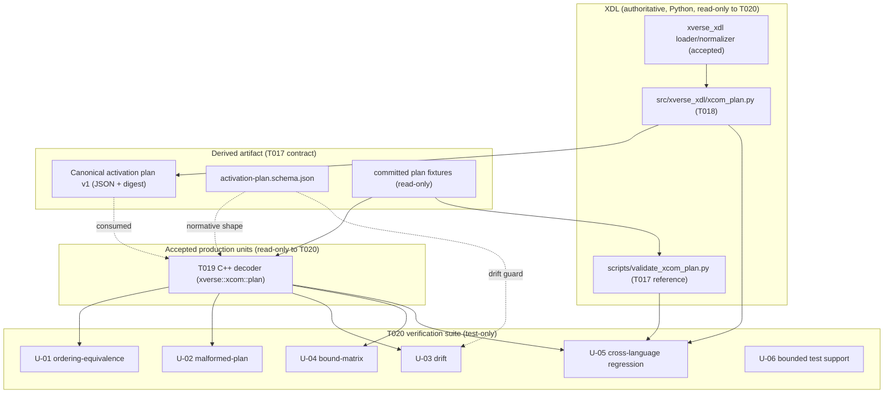
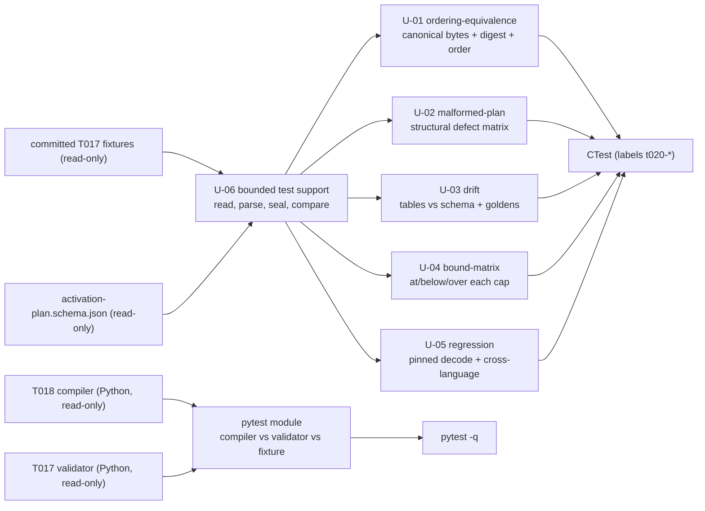

# T020 Architecture — XDL-Derived Activation-Plan Verification Suite

## 1. Document control

| Field | Value |
| --- | --- |
| Task | T020 |
| Stage / role | plan → architecture |
| Revision | 1 |
| Baseline revision | `1e289bfe6234553df94eb25065371f7d423fad88` |
| Requirement authority | [`requirements.md`](requirements.md) rev 1 |
| Accepted architecture | `specs/007-xcom-core/plan.md` ("Technical Context", "Architecture", "Project Structure", "Delivery phases" 4, "Complexity Tracking"), `specs/007-xcom-core/contracts/{xdl-profile,communication-plan}.md`, `specs/007-xcom-core/data-model.md` |
| Consumed architecture model | `docs/engineering/xcom/t009/architecture-model.{json,md}` (`XCOM-CMP-003`, `XCOM-CMP-004`, `XCOM-XLC-001`, `XCOM-XB-003`) |
| Consumed unit design | `docs/engineering/xcom/t010/{requirements,design-units}.md` (`XCOM-DU-010`, `XCOM-DU-011`) |
| Consumed contract artifacts | `docs/engineering/xcom/t017/{architecture,detailed-design,verification-plan}.md`, `src/xverse/xcom/contracts/v1/activation-plan.schema.json`, `scripts/validate_xcom_plan.py`, `specs/007-xcom-core/contracts/xdl-profile.md` |
| Consumed producer/consumer artifacts | `src/xverse_xdl/xcom_plan.py` (T018 compiler), `src/xverse/xcom/{include/xverse/xcom/activation_plan.hpp,src/activation_plan.cpp}` (T019 decoder) — anchored, unchanged |
| Governing ADRs | ADR-0016 (subsystem naming/ownership), ADR-0018 (platform-first), ADR-0020 (repository-owned work products and evidence) |
| Consumes | `docs/engineering/xcom/task-ownership.{md,json}`, `docs/engineering/xcom/t008/{requirements-register,traceability-matrix}.{json,md}`, `docs/engineering/xcom/{build-environment,dependency-lock}.md`, `docs/engineering/xcom/t025/test-dependency-admission.md`, `cmake/XComOfflineDependencies.cmake`, `cmake/XComWarnings.cmake` |
| Maturity | Verification target for the XDL-derived plan chain; no production, runtime, activation, or acceptance claim |

## 2. Position in the accepted architecture

T020 is the final task of phase 4 (XDL-derived activation plan) of capability 007. T017 **defines** the
activation-plan v1 schema and the digest/provenance contract; T018 **produces** a conforming canonical plan;
T019 **independently decodes and re-checks** it in C++; **T020 independently verifies** the whole chain with
ordering-equivalence, malformed-plan, drift, bound, and regression suites before the integration and review
tasks consolidate the evidence. T020 is a pure consumer of the accepted `XCOM-XB-003` boundary
(activation plan → core decoder, carrying `XCOM-XLC-001`); it creates no component, contract, or production
artifact.



**Dependency order.** T007 (ownership) → T008 (requirements) → T009 (architecture) → T010 (unit design) →
T011 (dependency admission) → `T-CORE` → T017 (Profile/plan/digest contracts) → T018 (compiler) →
T019 (decoder) → **T020 (ordering-equivalence, malformed-plan, drift, bound, and regression suites)** →
`T-INTG` → `T-REVIEW` → T041. This preserves the `tasks.md` "Dependencies and execution order" statement that
T017–T020 bind the core to XDL, and the requirement that T020 test the accepted chain without implementing any
other task.

T020 refines, and never replaces, the accepted architecture. T009 answers *what the components, boundaries,
and contracts are*; T010 answers *how each implementing unit owns, lives, synchronizes, fails, is bounded, and
is documented*; T017 answers *what exact schema and digest rule cross the boundary*; T018 answers *how the plan
is compiled*; T019 answers *how the plan is decoded and independently verified before activation*; **T020
answers *how the accepted chain's equivalence, rejection, drift-resistance, bounds, and regression are
proven***. `T020-U-01`..`T020-U-05` extend the verification coverage of `XCOM-DU-010` and `XCOM-DU-011`;
`T020-U-06`/`T020-U-07` are the support and wiring units; `T020-U-08` is the work-product unit. No new T009
component or contract is created and no accepted `XCOM-DU-###` is renamed.

## 3. Architectural decomposition

### 3.1 The verification boundary

| Boundary | Artifact | Owner | Purpose |
| --- | --- | --- | --- |
| `XCOM-XB-003` plan → core decoder (consumed) | Canonical plan bytes + `activation-plan.schema.json` + digest rule | T017 defines, T019 consumes, **T020 verifies** | Prove the consumed boundary is equivalent, fail-closed, drift-resistant, bounded, and regression-pinned |
| `XCOM-XLC-001` cross-language schema (consumed) | `src/xverse/xcom/contracts/v1/activation-plan.schema.json` | T017 defines, **T020 guards** | The single interface (member names, vocabularies, canonicalization, digest) between Python and C++ |
| test source → deterministic gate | GTest/CTest targets and `pytest` module | **T020 produces**, `T-INTG`/`T-REVIEW`/T041 consolidate | Reproducible, exact-candidate evidence the gate discovers and runs |

### 3.2 Layer rules (invariants)

1. **Test-only, derived-consumer.** T020 adds test source and build/test wiring only. It defines no production
   unit, no configuration language, and no runtime behaviour; it reads the derived canonical plan and the
   committed schema/fixtures/compiler/decoder, and re-parses nothing else.
2. **One-way dependency.** The C++ suites depend only on the C++20 standard library, the already-admitted
   `nlohmann/json` header, the already-required GTest/gmock prefix, and the T019 decoder library. The Python
   module depends only on the admitted interpreter, the standard library, and the repository's own read-only
   `xverse_xdl.xcom_plan` and T017 validator modules. No legacy artifact, no new admitted dependency, and no
   X-COM runtime unit is imported.
3. **Read-only anchors.** T017, T018, and T019 source, schemas, contracts, fixtures, and tests are consumed
   read-only. T020 changes none of them and weakens no existing requirement, schema, contract, or test.
4. **Fail closed.** A malformed, out-of-order, drifted, or over-bound input must be classified
   `rejected`/`failed` with a stable code and **no** decoded value; no T020 case may report `accepted` for a
   defective input.
5. **Deterministic.** Every case is a pure function of bounded, repository-owned inputs; no clock, network,
   subprocess, thread, or ambient-state input exists; the same case run repeatedly yields the same result
   (`SC-002`).
6. **Bounded.** Every synthetic input and every exercised `DecodeLimits` is finite; the bound-matrix cases use
   small, bounded vectors and adjusted caps, never unbounded allocation; overflow is `fail-closed`.
7. **Cross-language anchor.** Equivalence across Python and C++ is proven by both independently reproducing the
   canonical body and digest of the same committed fixture and agreeing on the pinned golden values, plus the
   Python module's compiler-versus-validator comparison. No cross-process invocation is used (A-4).
8. **Domain neutral.** No case, code, or constant names an ECU, CAN, SOME/IP, Zenoh, or product-specific
   primitive; domain semantics arrive only through the plan/profile boundary.
9. **Public safe.** Every input is repository-owned, synthetic, or a read-only committed fixture; no credential,
   private address, unrestricted payload, or absolute host path is authored or retained. Python paths are
   derived from `__file__` at run time.

### 3.3 Verification data flow



The C++ path reads the embedded-member tables from the committed schema and the immutable decoded value from
the T019 decoder; the Python path compiles synthetic normalized graphs and cross-checks the T017 validator.
Both paths pin the same committed fixture's canonical body and digest, so a change in either language's
canonicalization/digest rule fails a suite.

### 3.4 Traceability chain

```text
SC-002 ──refines──▶ XCOM-SYS-SC-002 ──allocated_to──▶ XCOM-SW-XDL-003 ──verified_by──▶ XCOM-T-XDL
XCOM-SW-XDL-001 (schema/digest) ──verified_by──▶ T020-U-03 (drift) + T020-U-05 (regression)
XCOM-SW-XDL-002 (compile) ──verified_by──▶ T020-U-05 (cross-language regression, Python)
XCOM-SW-CORE-003 (fail-before-activation) ──verified_by──▶ T020-U-02 (malformed-plan)
XCOM-DU-010/XCOM-DU-011 ──extended_evidence──▶ T020-U-01..U-05
contracts/{xdl-profile,communication-plan}.md ──elaborated_by──▶ T020-U-01..U-05 records
T017/T018/T019 artifacts ──read_only──▶ T020 suites (no edit)
XVE-SYS-0139..0158 ──no promotion──▶ ref002.disposition = "unchanged", promoted = []
```

## 4. Artifact decomposition

| Artifact | Path | Stage | Owner | Purpose |
| --- | --- | --- | --- | --- |
| Plan work products (5 docs) | `docs/engineering/xcom/t020/{requirements,architecture,detailed-design,unit-specifications,verification-plan}.md` | plan | T020 / `T-XDL` | This bounded design package |
| Bounded test support | `tests/xcom/activation_plan/t020_support.hpp` | implementation | T020 / `T-XDL` | Header-only fixture read, parse, seal, canonical-compare, and assert helpers |
| Ordering-equivalence suite | `tests/xcom/activation_plan/t020_ordering_equivalence_tests.cpp` | implementation | T020 / `T-XDL` | `T20-ORD-*`, `T20-DET-*` |
| Malformed-plan suite | `tests/xcom/activation_plan/t020_malformed_plan_tests.cpp` | implementation | T020 / `T-XDL` | `T20-MAL-*` |
| Drift suite | `tests/xcom/activation_plan/t020_drift_tests.cpp` | implementation | T020 / `T-XDL` | `T20-DRF-*` |
| Bound-matrix suite | `tests/xcom/activation_plan/t020_bound_matrix_tests.cpp` | implementation | T020 / `T-XDL` | `T20-BND-*` |
| Regression suite | `tests/xcom/activation_plan/t020_regression_tests.cpp` | implementation | T020 / `T-XDL` | `T20-REG-*` |
| Cross-language Python suite | `tests/xcom/activation_plan/test_xcom_plan_ordering_equivalence.py` | implementation | T020 / `T-XDL` | Compiler-vs-validator equivalence and fixture regression |
| Build/test wiring | `src/xverse/xcom/CMakeLists.txt` (shared) | implementation | shared | CTest targets and `t020` labels; the pre-existing timing benchmark's registration is unchanged (rev 4 reverted the out-of-scope rev-3 property change; see `implementation.md` §10) |
| Implementation record | `docs/engineering/xcom/t020/implementation.md` | implementation | T020 / `T-XDL` | Candidate revision, commands, outcomes, limitations |
| Capability task state | `specs/007-xcom-core/tasks.md` (shared) | implementation | shared | Mark T020 complete only in the implementation stage |
| Internal review | `docs/engineering/xcom/t020/internal-review.json` | review | T020 / `T-XDL` | Separate read-only review verdict and findings |
| Package manifest | `reports/xcom-queue/t020-package.json` | package | workflow | Exact-candidate changed paths and hashes |

## 5. Product paths T020 creates and anchors

T020 **creates** the eight `tests/xcom/activation_plan/t020_*`/`test_xcom_plan_ordering_equivalence.py` sources and
the five plan work products and implementation record under `docs/engineering/xcom/t020/`. It **anchors but
never changes** the T017 artifacts (`xdl/profiles/xcom-v0.1.schema.json`,
`src/xverse/xcom/contracts/v1/activation-plan.schema.json`, `scripts/validate_xcom_plan.py`,
`specs/007-xcom-core/contracts/xdl-profile.md`, the T017 Python test modules and fixtures under
`tests/xcom/activation_plan/`), the T018 artifacts (`src/xverse_xdl/xcom_plan.py`, `tests/test_xcom_plan.py`),
and the T019 artifacts (`src/xverse/xcom/include/xverse/xcom/activation_plan.hpp`,
`src/xverse/xcom/src/activation_plan.cpp`, `tests/xcom/activation_plan/decoder_unit_tests.cpp`,
`tests/xcom/activation_plan/decoder_negative_tests.cpp`).

`tests/xcom/activation_plan/` is the `T-XDL` shared test path: the T017 Python modules and JSON fixtures
remain untouched, T019 adds `decoder_unit_tests.cpp` and `decoder_negative_tests.cpp`, and T020 adds the
`t020_*`/`test_xcom_plan_ordering_equivalence.py` sources. Per the T007 per-task artifact rule,
`docs/engineering/xcom/t020/` and `reports/xcom-queue/t020-package.json` remain reserved to T020.

## 6. Baseline, authorization, and ownership binding

- **Authorized baseline**: `1e289bfe6234553df94eb25065371f7d423fad88`, validated by `git rev-parse`. No tag,
  branch, or ambient state is a valid binding. This baseline is the reviewed T019 terminal package; the T017
  and T018 reviewed packages remain historical predecessor bindings.
- **Candidate revision rule**: each candidate records its own exact revision and its accepted predecessor
  revision; acceptance is per candidate and never inherited from a sibling or from source presence.
- **Authorization references**: ACC002, ACC003, ACC013, ACC014, ACC015; ADR-0016, ADR-0018, ADR-0020.
- **Safety boundary** (from ACC011/ACC014 and the spec exclusions): no legacy adapter/execution, external
  peer, TCP listener, physical bus, deployment, or compatibility claim; the suites bind nothing and emit
  nothing.
- **Ownership binding**: T020 belongs to the `T-XDL` slice (T007 assignment). Its exclusive paths
  (`docs/engineering/xcom/t020/`, `reports/xcom-queue/t020-package.json`, `tests/xcom/activation_plan/`) are
  declared in the `T-XDL` exclusive list; `src/xverse/xcom/CMakeLists.txt`,
  `cmake/XComOfflineDependencies.cmake`, and `specs/007-xcom-core/tasks.md` are declared shared paths. No
  ownership-register edit is required for T020.
- **Review/acceptance**: independent read-only review (T039) before explicit user acceptance (T041). T020
  neither performs nor presumes either.

## 7. Build and verification integration

- T020 adds five CTest targets to the **shared** `src/xverse/xcom/CMakeLists.txt`
  (`xverse_xcom_activation_plan_t020_<kind>_tests` for `kind ∈ {ordering_equivalence, malformed_plan, drift,
  bound_matrix, regression}`), each linking `xverse::xcom_activation_plan`, `GTest::gtest_main`, `GTest::gmock`,
  and `Threads::Threads`, defining the fixture path `XCOM_ACTIVATION_PLAN_FIXTURE_DIR` and the schema path
  `XCOM_ACTIVATION_PLAN_SCHEMA_PATH`, and registered with
  `gtest_discover_tests(... PROPERTIES LABELS "t020-<kind>")` (rev 2; the single hyphenated label is used
  because CMake 3.22 `gtest_discover_tests` splits a semicolon label list). The T019 targets and every other
  target are unchanged.
- The T020 Python module is a plain `test_*.py` under `tests/xcom/activation_plan/` and needs no configuration
  change; it is collected by `python3 -m pytest -q`.
- The deterministic gate for T020 is invoked by the Workflow harness as
  `automation/xcom_feature_gate.py verify T020 1e289bf…` (an environment-neutral locator; no host-specific
  absolute path is retained). It requires the six work products, the T020 checkbox marked, a changed path
  under `tests/`, `git diff --check` clean, a passing `pytest`, and a passing `cmake` configure/build plus
  `ctest` run that discovers at least one test.
- T020 changes no T017 artifact, so the T017 `run_checks`/`--check-human` expectation and fixture set are
  unchanged; T020 adds no fixture under `tests/xcom/activation_plan/fixtures/` and uses the committed
  `plan/valid/` fixtures read-only plus inline synthetic vectors.

**Affected paths and bounds.** The T020 candidate affects only §4's paths. The decode bounds and decoded-entity
caps are the finite declared `DecodeLimits` in `docs/engineering/xcom/t019/unit-specifications.md` §3.4;
overflow policy is `fail-closed`. No concurrency bound applies (T020 spawns no thread and holds no mutable
shared state). Negative/determinism/bound cases are `T20-ORD-*`, `T20-MAL-*`, `T20-DRF-*`, `T20-BND-*`,
`T20-REG-*`, `T20-DET-*`, and `T20-G01`..`T20-G05` in [`verification-plan.md`](verification-plan.md) §4–§7.

**A-1 environment input.** The gate's `cmake` configure requires the already-admitted offline inputs
`XVERSE_XCOM_TOOLCHAIN`, `XVERSE_XCOM_PACKAGE_MANIFEST`, and `XVERSE_XCOM_T025_TEST_TOOLCHAIN`, which are
provisioned outside the repository. If the run process environment does not carry them, the implementation
stage may reuse the narrow A-1 fallback that T019 recorded in the shared build paths
(`cmake/XComOfflineDependencies.cmake`, `src/xverse/xcom/CMakeLists.txt`) without weakening hash-verified
admission, and must record the resolution in `implementation.md`; otherwise it records a blocker rather than
weakening the gate.

## 8. Risks and controls

| Risk | Control |
| --- | --- |
| A test silently duplicates or weakens a T019 `NEG-D*` case | Distinct `T20-*` identifiers; review compares the case sets; no T019 file is edited (`T20-G02`, `T20-G05`) |
| A bound-matrix case allocates an unbounded document | Cases use small vectors and adjusted caps; the byte/depth/node bounds are asserted directly (`T20-BND-01`..`T20-BND-11`) |
| A drift guard reads a stale copy of the schema | The suite reads the committed `activation-plan.schema.json` at test time via the compile-time path; it caches nothing (`T20-DRF-01`..`T20-DRF-09`) |
| A change to canonicalization or digest goes unnoticed | Golden canonical-body hash and golden digest pinned for the committed fixtures (`T20-REG-03`, `T20-REG-08`) |
| A C++ test attempts to invoke Python or the network | Source review and the C++ suites use only the decoder API; the Python module performs no subprocess/I/O write (`T20-G03`, `T20-G05`) |
| A production source path is touched | The gate's changed-path check and the review confirm a tests-only plus docs plus shared-CMake change (`T20-G01`) |
