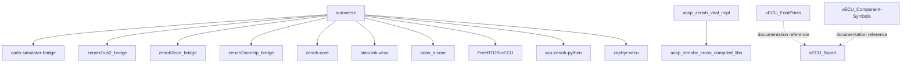

# Dependency map and startup evidence — M0

**Snapshot**: 2026-09-20. All edges below describe source declarations or documented relationships.
They do not establish deployed versions, launch ordering, health, or successful interoperability.
Names are unchanged. Raw source and deployment values remain in access-controlled repositories.
See [inventory](REPOSITORY_INVENTORY.md) and [interface limitations](INTERFACE_CATALOG.md).

## Declared workspace composition

The manifest is the evidence for all ten solid edges below. Arrows mean “imports/depends on”,
not dataflow or startup order. This is the legacy dependency graph, not vNext core dependency design.

Evidence: [autoverse/autoverse.repos](https://github.com/The-Xverse/autoverse/blob/fc9af6d6bb4de702a65bf0272b3c77256a5d1697/autoverse.repos); [aosp_zenoh_vhal_impl/README.md](https://github.com/The-Xverse/aosp_zenoh_vhal_impl/blob/5287bdb51bf8e23b91fb7cae90bb94c366557c52/README.md); [vECU_FootPrints/README.md](https://github.com/The-Xverse/vECU_FootPrints/blob/857b8fbf1571db154052383710f503c37c21d93e/README.md); [vECU_Component-Symbols/README.md](https://github.com/The-Xverse/vECU_Component-Symbols/blob/361c7af126c70263fe241b6afee0d1cb39eaf1ba/README.md).
The hardware dotted edges are README references, not proof of resolved EDA library dependencies.

| AutoVerse dependency | Declared version | Resolved commit | Matches inspected default branch |
|---|---|---|---|
| [carla-simulator-bridge](REPOSITORY_INVENTORY.md#repo-carla-simulator-bridge) | `v2.0.0` | `2859acd10a5e83babac0adbc51d3e6e42539027f` | Yes |
| [zenoh2ros2_bridge](REPOSITORY_INVENTORY.md#repo-zenoh2ros2_bridge) | `v1.0.0` | `ef83ee85b664d9defec1128a345803715ea3cba1` | Yes |
| [zenoh2can_bridge](REPOSITORY_INVENTORY.md#repo-zenoh2can_bridge) | `v1.0.0` | `087c5f8a2e63e01c4213cd33161b64e50ffd047d` | Yes |
| [zenoh2someip_bridge](REPOSITORY_INVENTORY.md#repo-zenoh2someip_bridge) | `v1.0.0` | `7c393c9f5a49239c76122486c49cb1993164475c` | Yes |
| [zenoh-core](REPOSITORY_INVENTORY.md#repo-zenoh-core) | `v2.0.0` | `e65b10287fcc60962cbd3dd42caadd94f69a91e3` | Yes |
| [simulink-vecu](REPOSITORY_INVENTORY.md#repo-simulink-vecu) | `v2.0.0` | `505ba3402713f41bc9c7bb2d2c12bf080d421957` | Yes |
| [adas_s-core](REPOSITORY_INVENTORY.md#repo-adas_s-core) | `v1.0.0` | `9ee0b31afed491c68952a2147aa3915dd4997ad7` | Yes |
| [FreeRTOS-vECU](REPOSITORY_INVENTORY.md#repo-freertos-vecu) | `v1.0.0` | `dcddaa85868ed359971cf3a490b6d13066a0e26b` | Yes |
| [vcu-zenoh-python](REPOSITORY_INVENTORY.md#repo-vcu-zenoh-python) | `v1.0.0` | `125566ef561fbd601defec22d5846068448722b9` | Yes |
| [zephyr-vecu](REPOSITORY_INVENTORY.md#repo-zephyr-vecu) | `v1.0.0` | `d93d0f17b38988783977b1adaeedbabcd0e3e0ec` | Yes |

Resolution was performed at capture time using commit lookup for each declared tag; pin records
are in [inventory-snapshot.json](inventory-snapshot.json). Tags can move later. The recorded full
commits, rather than a future tag resolution, identify this discovery baseline.

## Current launcher path: observed source, runtime unverified

The pinned step list selects the S-CORE path. Its opening docstring and the README describe a
simpler/older arrangement, so those descriptions must not override the actual configured steps.

| Order | Requested action | Readiness or lifecycle implication |
|---|---|---|
| Before start | Clean up CARLA and prior matching processes; invoke configured stop commands | Process-name/port cleanup may reach outside owned children; isolate later parity runs. |
| 1 | Start CARLA using the imported GPU-server recipe | Requires prepared simulator/GPU environment. |
| 2 | Start Python VCU | Requires compatible Zenoh/session configuration and vehicle/control inputs. |
| 3 | Start Zenoh/SOME-IP gateway | Requires built executable, libraries and matching mappings. |
| 4 | Start prepared S-CORE Compose containers | Compose `start` assumes containers already exist; it does not build/create them. |
| 5 | Start CARLA input automation | The inspected helper restarts the steering client at initialization and on a wheel trigger. |
| During run | Poll child processes; log exits | Exited children are removed from supervision; no restart is implemented in this loop. |
| On shutdown | Terminate child process groups, then clean up CARLA | A completed Compose command is not proof that its containers have stopped. |

[Configured steps](https://github.com/The-Xverse/autoverse/blob/fc9af6d6bb4de702a65bf0272b3c77256a5d1697/run_autoverse.py#L58-L104); [process/log handling](https://github.com/The-Xverse/autoverse/blob/fc9af6d6bb4de702a65bf0272b3c77256a5d1697/run_autoverse.py#L397-L448); [cleanup and supervision](https://github.com/The-Xverse/autoverse/blob/fc9af6d6bb4de702a65bf0272b3c77256a5d1697/run_autoverse.py#L483-L587); [input automation](https://github.com/The-Xverse/carla-simulator-bridge/blob/2859acd10a5e83babac0adbc51d3e6e42539027f/examples/automate.py).

**Observed limits**: the supervisor sleeps between steps rather than probing readiness; a start
exception is logged and the loop continues. Its shutdown function does not explicitly replay the
Compose stop action from the step list. These are static observations, not reproduced runtime
failures. A future wrapper must define ownership, health, failure propagation and container cleanup
without silently repairing or changing the legacy baseline.

## README cruise-control path: documented, runtime unverified

The AutoVerse README separately describes: build the Rust vehicle binary; start CARLA server;
start a manual CARLA client; start the Python PID controller; start the Rust vehicle binary;
publish target-speed and engagement inputs. The PID component is declared in the workspace but
is not in the current supervisor's active steps. The Rust binary is also not an explicit current
supervisor step. Do not combine these into a fictitious single launch sequence.

[README cruise-control instructions](https://github.com/The-Xverse/autoverse/blob/fc9af6d6bb4de702a65bf0272b3c77256a5d1697/README.md); [current PID inputs/outputs](https://github.com/The-Xverse/simulink-vecu/blob/505ba3402713f41bc9c7bb2d2c12bf080d421957/pid_controller/main.py); [Rust vehicle entrypoint](https://github.com/The-Xverse/zenoh-core/blob/e65b10287fcc60962cbd3dd42caadd94f69a91e3/vehicle/src/main.rs).

**G01 — baseline selection**: the source establishes both descriptions but does not identify which
is the owner-supported production parity target. Reviewers must select and freeze the intended
variant, environment and expected observations before M4. Current PID topics also differ from older
README examples; name similarity does not establish compatible payloads or timing.

## Other observed/documented dependencies

| Owner | Dependency or relation | Evidence and limitation |
|---|---|---|
| aosp_zenoh_vhal_impl | Android platform and companion Zenoh prebuilts | [build instructions](https://github.com/The-Xverse/aosp_zenoh_vhal_impl/blob/5287bdb51bf8e23b91fb7cae90bb94c366557c52/README.md); Android-generation compatibility needs confirmation. |
| aaos-vhal-bridge | Running AAOS emulator, adb and VHAL socket | [gateway prerequisites](https://github.com/The-Xverse/aaos-vhal-bridge/blob/336f12301dbb0e778180566839c4892407cd875e/README.md); absent from current AutoVerse manifest. |
| zenoh-core | Relative CARLA Rust binding plus Zenoh/Tokio | [build manifest](https://github.com/The-Xverse/zenoh-core/blob/e65b10287fcc60962cbd3dd42caadd94f69a91e3/vehicle/Cargo.toml); external binding revision not pinned here. |
| digital-cluster-vecu | Android/Compose and messaging libraries | [Gradle manifest](https://github.com/The-Xverse/digital-cluster-vecu/blob/3d35327e4acdd292e85b82901af65ef129b3f227/app/build.gradle.kts); bundled APK identity elsewhere remains unproven. |
| HwSim | Optional upstream Robot Framework, web and Zenoh packages | [package manifest](https://github.com/The-Xverse/HwSim/blob/27bba949417483e618d2564401b27b1a39d5c439/pyproject.toml); no proven dependency on The-Xverse/robot-framework. |
| c-shenron-rfe | CARLA and numerical/model tooling | [research prerequisites](https://github.com/The-Xverse/c-shenron-rfe/blob/d86b495613cd94f59c0ac315032aa7b30de173af/README.md); shared CARLA dependency is not AutoVerse integration. |
| aaos_cuttlefish | Docker/Cuttlefish/AOSP and packaged APK | [lifecycle instructions](https://github.com/The-Xverse/aaos_cuttlefish/blob/a794faf61c1f8173730a09428962d6dc8c42a59b/README.md); claimed supervisor linkage is not in pinned AutoVerse sources. |
| vECU_Board | External footprint library path | [library table](https://github.com/The-Xverse/vECU_Board/blob/ee5e295843e1ad591ca76db5b9abd41e1ca30243/vECU_STM32fF411/fp-lib-table); machine-specific path omitted, resolution unverified. |

## Unestablished edges and scope limits

No further executable repository-to-repository edge is asserted for .github, x-verse,
robot-framework, real_simulink, feature-radar-sensor-streaming, synchronous-simulation-mode,
vECU-Grafic-User-Interface, or Zephyr-BCM. Their individual evidence and purpose remain in the
inventory. A shared protocol, similar repository name, or documentation reference is not enough to
assert runtime composition. Archives, firmware binaries, downloaded images and lab wiring were
not inspected at runtime. No vNext-to-legacy runtime dependency has been implemented by M0.

## Supplemental context received after M0 review

The user confirmed the inventory review on 2026-09-20 and supplied a technical synthesis and SADS.
The synthesis reports an AutoVerse v2.0.0/S-CORE release baseline and a fuller bring-up sequence than
the pinned launcher. These remain documented context, separate from the source observations above.
See the [reference register](../architecture/REFERENCE_REGISTER.md) and
[review disposition](../reviews/M0_REVIEW_CHECKLIST.md). No alternative executable baseline was
silently selected and no source pin was changed.
